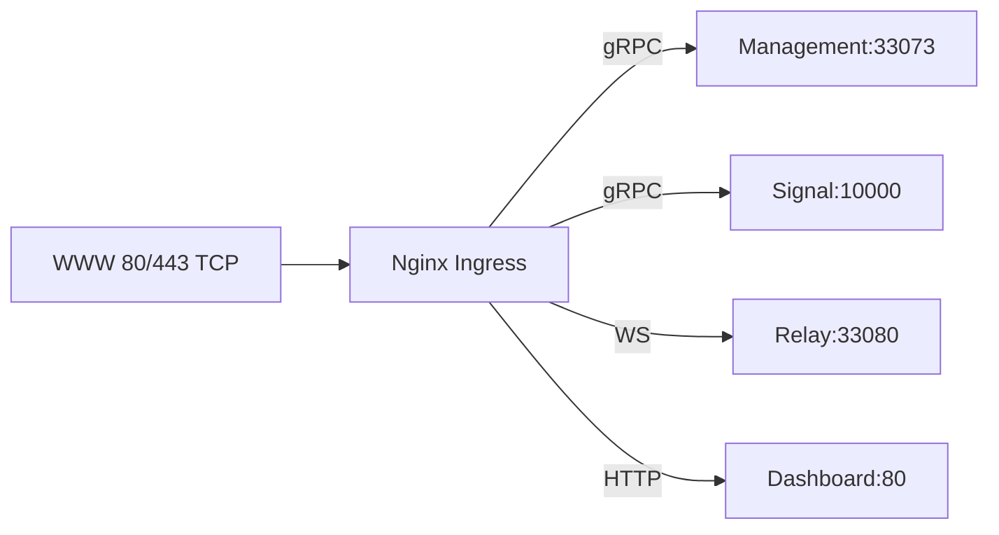

# netbird-management

  

A Helm chart for an easier netbird management stack (https://netbird.io) deployment at kubernetes.

**Homepage:** <https://github.com/CodeAdminDe/helm-charts>

## Maintainers

| Name | Email | Url |
| ---- | ------ | --- |
| Frederic Roggon | <frederic.roggon@codeadmin.de> | <https://github.com/CodeAdminDe> |

## Requirements

| Repository | Name | Version |
|------------|------|---------|
| https://codeadminde.github.io/helm-charts | libchart-cnps(libchart-cnps) | 0.2.1 |

## TL;DR

You don't want to read through the docs? That's the quick and dirty way:

```bash
helm repo add codeadminde https://codeadminde.github.io/helm-charts/
helm repo update
helm install netbird-management codeadminde/netbird-management
```
_**Note**: If you want to speicify a namespace, provide the name via the `-n` (or `--namespace`) flag. You need to create the desired namespace beforhand._

> I'd recommend to read trough the docs. Skip them at your own risk. ;-)

## Repository

In order to install / query / etc... the charts, you'll need to add the repository:

```bash
helm repo add codeadminde https://codeadminde.github.io/helm-charts/
helm repo update
```

## Installation

To install the chart with the release name `netbird-management`

```bash
helm install netbird-management codeadminde/netbird-management
```
_**Note**: If you want to speicify a namespace, provide the name via the `-n` (or `--namespace`) flag. You need to create the desired namespace beforhand._

## Uninstallation

To uninstall the chart release named `netbird-management`

```bash
helm uninstall netbird-management
```
_**Note**: If you want to speicify a namespace, provide the name via the `-n` (or `--namespace`) flag. You need to create the desired namespace beforhand._

The command removes all the Kubernetes components associated with the chart **including persistent volumes** and deletes the release.

## Configuration

Take a look at the [values.yaml](./values.yaml) file of the chart. It contains the default configuration and additional notes.
So it would be a good idea to take a look at it, even if you already know what you would like to accomplish.

To configure the release (chart values), provide your own values via a *.yaml file and reference it with the `-f` flag.

> #### Sample
>
> ```bash
> helm install netbird-management codeadminde/netbird-management -f values.yaml
> ```

Alternatively, you could provide the values which you want to override at the CLI directly. Than you've to provide the values as key=value pair(s), referenced by the `--set` flag.

> #### Sample
>
> ```bash
> helm install netbird-management --set key=value --set keyTwo=secondValue codeadminde/netbird-management
> ```

## Values

<table height="800px" >
	<thead>
		<th>Key</th>
		<th>Type</th>
		<th>Default</th>
		<th>Description</th>
	</thead>
	<tbody>
		<tr>
			<td id="authentik"><a href="./values.yaml#L314">authentik</a></td>
			<td>
object
</td>
			<td>
				<div style="max-width: 300px;">
<pre lang="json">
{
  "appSlug": "de_example_nb",
  "clientId": "your-client-id",
  "clientSecret": "",
  "device": {
    "clientId": "your-client-id",
    "clientSecret": "",
    "isPublicClient": true,
    "scopes": "openid",
    "type": "hosted",
    "useIdToken": false
  },
  "domain": "https://auth.example.com",
  "enabled": true,
  "isPublicClient": true,
  "issuer": "https://auth.example.com",
  "scopes": "openid profile email offline_access api",
  "serviceAccount": {
    "password": "",
    "username": "netbird"
  },
  "useIdToken": false
}
</pre>
</div>
			</td>
			<td>Authentik OIDC configuration</td>
		</tr>
		<tr>
			<td id="authentik--appSlug"><a href="./values.yaml#L320">authentik.appSlug</a></td>
			<td>
string
</td>
			<td>
				<div style="max-width: 300px;">
<pre lang="json">
"de_example_nb"
</pre>
</div>
			</td>
			<td>Authentik application slug</td>
		</tr>
		<tr>
			<td id="authentik--clientId"><a href="./values.yaml#L326">authentik.clientId</a></td>
			<td>
string
</td>
			<td>
				<div style="max-width: 300px;">
<pre lang="json">
"your-client-id"
</pre>
</div>
			</td>
			<td>Authentik client ID</td>
		</tr>
		<tr>
			<td id="authentik--clientSecret"><a href="./values.yaml#L328">authentik.clientSecret</a></td>
			<td>
string
</td>
			<td>
				<div style="max-width: 300px;">
<pre lang="json">
""
</pre>
</div>
			</td>
			<td>Authentik client secret (only required for confidential clients)</td>
		</tr>
		<tr>
			<td id="authentik--device"><a href="./values.yaml#L340">authentik.device</a></td>
			<td>
object
</td>
			<td>
				<div style="max-width: 300px;">
<pre lang="json">
{
  "clientId": "your-client-id",
  "clientSecret": "",
  "isPublicClient": true,
  "scopes": "openid",
  "type": "hosted",
  "useIdToken": false
}
</pre>
</div>
			</td>
			<td>Device code flow configuration</td>
		</tr>
		<tr>
			<td id="authentik--device--clientId"><a href="./values.yaml#L346">authentik.device.clientId</a></td>
			<td>
string
</td>
			<td>
				<div style="max-width: 300px;">
<pre lang="json">
"your-client-id"
</pre>
</div>
			</td>
			<td>Device code flow client ID</td>
		</tr>
		<tr>
			<td id="authentik--device--clientSecret"><a href="./values.yaml#L348">authentik.device.clientSecret</a></td>
			<td>
string
</td>
			<td>
				<div style="max-width: 300px;">
<pre lang="json">
""
</pre>
</div>
			</td>
			<td>Device code flow client secret (only required for confidential clients)</td>
		</tr>
		<tr>
			<td id="authentik--device--isPublicClient"><a href="./values.yaml#L344">authentik.device.isPublicClient</a></td>
			<td>
bool
</td>
			<td>
				<div style="max-width: 300px;">
<pre lang="json">
true
</pre>
</div>
			</td>
			<td>Device code flow client is public</td>
		</tr>
		<tr>
			<td id="authentik--device--scopes"><a href="./values.yaml#L350">authentik.device.scopes</a></td>
			<td>
string
</td>
			<td>
				<div style="max-width: 300px;">
<pre lang="json">
"openid"
</pre>
</div>
			</td>
			<td>Device code flow OIDC scopes</td>
		</tr>
		<tr>
			<td id="authentik--device--type"><a href="./values.yaml#L342">authentik.device.type</a></td>
			<td>
string
</td>
			<td>
				<div style="max-width: 300px;">
<pre lang="json">
"hosted"
</pre>
</div>
			</td>
			<td>Device code flow type (hosted or none to disable)</td>
		</tr>
		<tr>
			<td id="authentik--device--useIdToken"><a href="./values.yaml#L352">authentik.device.useIdToken</a></td>
			<td>
bool
</td>
			<td>
				<div style="max-width: 300px;">
<pre lang="json">
false
</pre>
</div>
			</td>
			<td>Use ID token instead of access token for device flow</td>
		</tr>
		<tr>
			<td id="authentik--domain"><a href="./values.yaml#L318">authentik.domain</a></td>
			<td>
string
</td>
			<td>
				<div style="max-width: 300px;">
<pre lang="json">
"https://auth.example.com"
</pre>
</div>
			</td>
			<td>Authentik domain URL</td>
		</tr>
		<tr>
			<td id="authentik--enabled"><a href="./values.yaml#L316">authentik.enabled</a></td>
			<td>
bool
</td>
			<td>
				<div style="max-width: 300px;">
<pre lang="json">
true
</pre>
</div>
			</td>
			<td>Enable Authentik OIDC</td>
		</tr>
		<tr>
			<td id="authentik--isPublicClient"><a href="./values.yaml#L324">authentik.isPublicClient</a></td>
			<td>
bool
</td>
			<td>
				<div style="max-width: 300px;">
<pre lang="json">
true
</pre>
</div>
			</td>
			<td>Authentik client is public (no client secret required)</td>
		</tr>
		<tr>
			<td id="authentik--issuer"><a href="./values.yaml#L322">authentik.issuer</a></td>
			<td>
string
</td>
			<td>
				<div style="max-width: 300px;">
<pre lang="json">
"https://auth.example.com"
</pre>
</div>
			</td>
			<td>Authentik issuer URL</td>
		</tr>
		<tr>
			<td id="authentik--scopes"><a href="./values.yaml#L330">authentik.scopes</a></td>
			<td>
string
</td>
			<td>
				<div style="max-width: 300px;">
<pre lang="json">
"openid profile email offline_access api"
</pre>
</div>
			</td>
			<td>OIDC scopes to request</td>
		</tr>
		<tr>
			<td id="authentik--serviceAccount"><a href="./values.yaml#L334">authentik.serviceAccount</a></td>
			<td>
object
</td>
			<td>
				<div style="max-width: 300px;">
<pre lang="json">
{
  "password": "",
  "username": "netbird"
}
</pre>
</div>
			</td>
			<td>Service account configuration</td>
		</tr>
		<tr>
			<td id="authentik--serviceAccount--password"><a href="./values.yaml#L338">authentik.serviceAccount.password</a></td>
			<td>
string
</td>
			<td>
				<div style="max-width: 300px;">
<pre lang="json">
""
</pre>
</div>
			</td>
			<td>Service account password</td>
		</tr>
		<tr>
			<td id="authentik--serviceAccount--username"><a href="./values.yaml#L336">authentik.serviceAccount.username</a></td>
			<td>
string
</td>
			<td>
				<div style="max-width: 300px;">
<pre lang="json">
"netbird"
</pre>
</div>
			</td>
			<td>Service account username</td>
		</tr>
		<tr>
			<td id="authentik--useIdToken"><a href="./values.yaml#L332">authentik.useIdToken</a></td>
			<td>
bool
</td>
			<td>
				<div style="max-width: 300px;">
<pre lang="json">
false
</pre>
</div>
			</td>
			<td>Use ID token instead of access token</td>
		</tr>
		<tr>
			<td id="cnps"><a href="./values.yaml#L405">cnps</a></td>
			<td>
object
</td>
			<td>
				<div style="max-width: 300px;">
<pre lang="json">
{
  "appTraffic": {
    "egress": {
      "allow": true,
      "matchLabels": {},
      "toEntities": []
    },
    "ingress": {
      "allow": true,
      "matchLabels": {},
      "metrics": {
        "matchLabels": {}
      }
    }
  },
  "cnpgTraffic": {
    "instanceExtraEgress": []
  }
}
</pre>
</div>
			</td>
			<td>Application-specific Cilium Network Policies configuration @description Requires CiliumNetworkPolicies library-chart. These settings will be ignored if the library-chart is not available. These settings are directly related to the application and will not influence namespace-wide policies (e.g., for DNS egress traffic).</td>
		</tr>
		<tr>
			<td id="cnps--appTraffic"><a href="./values.yaml#L407">cnps.appTraffic</a></td>
			<td>
object
</td>
			<td>
				<div style="max-width: 300px;">
<pre lang="json">
{
  "egress": {
    "allow": true,
    "matchLabels": {},
    "toEntities": []
  },
  "ingress": {
    "allow": true,
    "matchLabels": {},
    "metrics": {
      "matchLabels": {}
    }
  }
}
</pre>
</div>
			</td>
			<td>Application traffic policies</td>
		</tr>
		<tr>
			<td id="cnps--appTraffic--egress"><a href="./values.yaml#L426">cnps.appTraffic.egress</a></td>
			<td>
object
</td>
			<td>
				<div style="max-width: 300px;">
<pre lang="json">
{
  "allow": true,
  "matchLabels": {},
  "toEntities": []
}
</pre>
</div>
			</td>
			<td>Egress traffic configuration</td>
		</tr>
		<tr>
			<td id="cnps--appTraffic--egress--allow"><a href="./values.yaml#L428">cnps.appTraffic.egress.allow</a></td>
			<td>
bool
</td>
			<td>
				<div style="max-width: 300px;">
<pre lang="json">
true
</pre>
</div>
			</td>
			<td>Allow egress traffic</td>
		</tr>
		<tr>
			<td id="cnps--appTraffic--egress--matchLabels"><a href="./values.yaml#L431">cnps.appTraffic.egress.matchLabels</a></td>
			<td>
object
</td>
			<td>
				<div style="max-width: 300px;">
<pre lang="json">
{}
</pre>
</div>
			</td>
			<td>Labels to match egress destinations @description Allows overriding default egress labels to match your security requirements.</td>
		</tr>
		<tr>
			<td id="cnps--appTraffic--egress--toEntities"><a href="./values.yaml#L435">cnps.appTraffic.egress.toEntities</a></td>
			<td>
list
</td>
			<td>
				<div style="max-width: 300px;">
<pre lang="json">
[]
</pre>
</div>
			</td>
			<td>Entities to allow egress to (e.g., world) @description Allows overriding default egress entities to match your security requirements.   - world</td>
		</tr>
		<tr>
			<td id="cnps--appTraffic--ingress"><a href="./values.yaml#L409">cnps.appTraffic.ingress</a></td>
			<td>
object
</td>
			<td>
				<div style="max-width: 300px;">
<pre lang="json">
{
  "allow": true,
  "matchLabels": {},
  "metrics": {
    "matchLabels": {}
  }
}
</pre>
</div>
			</td>
			<td>Ingress traffic configuration</td>
		</tr>
		<tr>
			<td id="cnps--appTraffic--ingress--allow"><a href="./values.yaml#L411">cnps.appTraffic.ingress.allow</a></td>
			<td>
bool
</td>
			<td>
				<div style="max-width: 300px;">
<pre lang="json">
true
</pre>
</div>
			</td>
			<td>Allow ingress traffic</td>
		</tr>
		<tr>
			<td id="cnps--appTraffic--ingress--matchLabels"><a href="./values.yaml#L416">cnps.appTraffic.ingress.matchLabels</a></td>
			<td>
object
</td>
			<td>
				<div style="max-width: 300px;">
<pre lang="json">
{}
</pre>
</div>
			</td>
			<td>Labels to match ingress controller pods @description Allows overriding default to match your ingress deployment.   app.kubernetes.io/name: ingress-nginx   io.kubernetes.pod.namespace: ingress-nginx</td>
		</tr>
		<tr>
			<td id="cnps--appTraffic--ingress--metrics"><a href="./values.yaml#L418">cnps.appTraffic.ingress.metrics</a></td>
			<td>
object
</td>
			<td>
				<div style="max-width: 300px;">
<pre lang="json">
{
  "matchLabels": {}
}
</pre>
</div>
			</td>
			<td>Metrics scraper configuration</td>
		</tr>
		<tr>
			<td id="cnps--appTraffic--ingress--metrics--matchLabels"><a href="./values.yaml#L424">cnps.appTraffic.ingress.metrics.matchLabels</a></td>
			<td>
object
</td>
			<td>
				<div style="max-width: 300px;">
<pre lang="json">
{}
</pre>
</div>
			</td>
			<td>Labels to match Prometheus pods @description Allows overriding default to match your prometheus deployment   app.kubernetes.io/name: prometheus   app.kubernetes.io/instance: kube-prometheus-stack-prometheus   io.kubernetes.pod.namespace: monitoring--kube-prometheus-stack</td>
		</tr>
		<tr>
			<td id="cnps--cnpgTraffic"><a href="./values.yaml#L437">cnps.cnpgTraffic</a></td>
			<td>
object
</td>
			<td>
				<div style="max-width: 300px;">
<pre lang="json">
{
  "instanceExtraEgress": []
}
</pre>
</div>
			</td>
			<td>CNPG traffic policies</td>
		</tr>
		<tr>
			<td id="cnps--cnpgTraffic--instanceExtraEgress"><a href="./values.yaml#L455">cnps.cnpgTraffic.instanceExtraEgress</a></td>
			<td>
list
</td>
			<td>
				<div style="max-width: 300px;">
<pre lang="json">
[]
</pre>
</div>
			</td>
			<td>Additional instance egress rules for external services (e.g., backup services) @description Add additional rule(s) as desired, to allow access to external backup services - toFQDNs:   - matchName: s3.storage.example.org   toPorts:     - ports:         - port: "443"           protocol: TCP ## OR ## - toEntities:   - world   toPorts:     - ports:         - port: "8443"           protocol: TCP ## OR ## ...</td>
		</tr>
		<tr>
			<td id="dashboard"><a href="./values.yaml#L240">dashboard</a></td>
			<td>
object
</td>
			<td>
				<div style="max-width: 300px;">
<pre lang="json">
{
  "enabled": true,
  "hpa": {
    "enabled": false,
    "maxReplicas": 10,
    "minReplicas": 2,
    "targetCPUUtilizationPercentage": 70
  },
  "image": {
    "pullPolicy": "IfNotPresent",
    "repository": "netbirdio/dashboard",
    "tag": "v2.25.0"
  },
  "metricsPort": 9090,
  "port": 80,
  "replicaCount": 1,
  "resources": {
    "limits": {
      "cpu": "200m",
      "memory": "256Mi"
    },
    "requests": {
      "cpu": "50m",
      "memory": "64Mi"
    }
  },
  "service": {
    "metricsPort": 9090,
    "port": 80,
    "type": "ClusterIP"
  }
}
</pre>
</div>
			</td>
			<td>Dashboard UI</td>
		</tr>
		<tr>
			<td id="dashboard--enabled"><a href="./values.yaml#L242">dashboard.enabled</a></td>
			<td>
bool
</td>
			<td>
				<div style="max-width: 300px;">
<pre lang="json">
true
</pre>
</div>
			</td>
			<td>Enable Dashboard</td>
		</tr>
		<tr>
			<td id="dashboard--hpa"><a href="./values.yaml#L274">dashboard.hpa</a></td>
			<td>
object
</td>
			<td>
				<div style="max-width: 300px;">
<pre lang="json">
{
  "enabled": false,
  "maxReplicas": 10,
  "minReplicas": 2,
  "targetCPUUtilizationPercentage": 70
}
</pre>
</div>
			</td>
			<td>Horizontal Pod Autoscaler configuration</td>
		</tr>
		<tr>
			<td id="dashboard--hpa--enabled"><a href="./values.yaml#L276">dashboard.hpa.enabled</a></td>
			<td>
bool
</td>
			<td>
				<div style="max-width: 300px;">
<pre lang="json">
false
</pre>
</div>
			</td>
			<td>Enable HPA</td>
		</tr>
		<tr>
			<td id="dashboard--hpa--maxReplicas"><a href="./values.yaml#L280">dashboard.hpa.maxReplicas</a></td>
			<td>
int
</td>
			<td>
				<div style="max-width: 300px;">
<pre lang="json">
10
</pre>
</div>
			</td>
			<td>Maximum replicas for HPA</td>
		</tr>
		<tr>
			<td id="dashboard--hpa--minReplicas"><a href="./values.yaml#L278">dashboard.hpa.minReplicas</a></td>
			<td>
int
</td>
			<td>
				<div style="max-width: 300px;">
<pre lang="json">
2
</pre>
</div>
			</td>
			<td>Minimum replicas for HPA</td>
		</tr>
		<tr>
			<td id="dashboard--hpa--targetCPUUtilizationPercentage"><a href="./values.yaml#L282">dashboard.hpa.targetCPUUtilizationPercentage</a></td>
			<td>
int
</td>
			<td>
				<div style="max-width: 300px;">
<pre lang="json">
70
</pre>
</div>
			</td>
			<td>Target CPU utilization percentage</td>
		</tr>
		<tr>
			<td id="dashboard--image"><a href="./values.yaml#L246">dashboard.image</a></td>
			<td>
object
</td>
			<td>
				<div style="max-width: 300px;">
<pre lang="json">
{
  "pullPolicy": "IfNotPresent",
  "repository": "netbirdio/dashboard",
  "tag": "v2.25.0"
}
</pre>
</div>
			</td>
			<td>Dashboard image repository, tag and pullPolicy</td>
		</tr>
		<tr>
			<td id="dashboard--metricsPort"><a href="./values.yaml#L253">dashboard.metricsPort</a></td>
			<td>
int
</td>
			<td>
				<div style="max-width: 300px;">
<pre lang="json">
9090
</pre>
</div>
			</td>
			<td>Dashboard metrics port</td>
		</tr>
		<tr>
			<td id="dashboard--port"><a href="./values.yaml#L251">dashboard.port</a></td>
			<td>
int
</td>
			<td>
				<div style="max-width: 300px;">
<pre lang="json">
80
</pre>
</div>
			</td>
			<td>Dashboard port</td>
		</tr>
		<tr>
			<td id="dashboard--replicaCount"><a href="./values.yaml#L244">dashboard.replicaCount</a></td>
			<td>
int
</td>
			<td>
				<div style="max-width: 300px;">
<pre lang="json">
1
</pre>
</div>
			</td>
			<td>Number of Dashboard replicas</td>
		</tr>
		<tr>
			<td id="dashboard--resources"><a href="./values.yaml#L262">dashboard.resources</a></td>
			<td>
object
</td>
			<td>
				<div style="max-width: 300px;">
<pre lang="json">
{
  "limits": {
    "cpu": "200m",
    "memory": "256Mi"
  },
  "requests": {
    "cpu": "50m",
    "memory": "64Mi"
  }
}
</pre>
</div>
			</td>
			<td>Resource requests and limits</td>
		</tr>
		<tr>
			<td id="dashboard--resources--limits--cpu"><a href="./values.yaml#L270">dashboard.resources.limits.cpu</a></td>
			<td>
string
</td>
			<td>
				<div style="max-width: 300px;">
<pre lang="json">
"200m"
</pre>
</div>
			</td>
			<td>CPU limit</td>
		</tr>
		<tr>
			<td id="dashboard--resources--limits--memory"><a href="./values.yaml#L272">dashboard.resources.limits.memory</a></td>
			<td>
string
</td>
			<td>
				<div style="max-width: 300px;">
<pre lang="json">
"256Mi"
</pre>
</div>
			</td>
			<td>Memory limit</td>
		</tr>
		<tr>
			<td id="dashboard--resources--requests--cpu"><a href="./values.yaml#L265">dashboard.resources.requests.cpu</a></td>
			<td>
string
</td>
			<td>
				<div style="max-width: 300px;">
<pre lang="json">
"50m"
</pre>
</div>
			</td>
			<td>CPU request</td>
		</tr>
		<tr>
			<td id="dashboard--resources--requests--memory"><a href="./values.yaml#L267">dashboard.resources.requests.memory</a></td>
			<td>
string
</td>
			<td>
				<div style="max-width: 300px;">
<pre lang="json">
"64Mi"
</pre>
</div>
			</td>
			<td>Memory request</td>
		</tr>
		<tr>
			<td id="dashboard--service--metricsPort"><a href="./values.yaml#L260">dashboard.service.metricsPort</a></td>
			<td>
int
</td>
			<td>
				<div style="max-width: 300px;">
<pre lang="json">
9090
</pre>
</div>
			</td>
			<td>Service metrics port</td>
		</tr>
		<tr>
			<td id="dashboard--service--port"><a href="./values.yaml#L258">dashboard.service.port</a></td>
			<td>
int
</td>
			<td>
				<div style="max-width: 300px;">
<pre lang="json">
80
</pre>
</div>
			</td>
			<td>Service port</td>
		</tr>
		<tr>
			<td id="dashboard--service--type"><a href="./values.yaml#L256">dashboard.service.type</a></td>
			<td>
string
</td>
			<td>
				<div style="max-width: 300px;">
<pre lang="json">
"ClusterIP"
</pre>
</div>
			</td>
			<td>Service type</td>
		</tr>
		<tr>
			<td id="existingAuthentikDeviceOidcSecret"><a href="./values.yaml#L311">existingAuthentikDeviceOidcSecret</a></td>
			<td>
string
</td>
			<td>
				<div style="max-width: 300px;">
<pre lang="json">
""
</pre>
</div>
			</td>
			<td>Existing Authentik device OIDC secret @description If not provided, Helm creates it automatically on first install based on provided values. Configured to not roll-over on upgrades to avoid breaking decryption on release upgrades.</td>
		</tr>
		<tr>
			<td id="existingAuthentikOidcSecret"><a href="./values.yaml#L307">existingAuthentikOidcSecret</a></td>
			<td>
string
</td>
			<td>
				<div style="max-width: 300px;">
<pre lang="json">
""
</pre>
</div>
			</td>
			<td>Existing Authentik OIDC secret @description If not provided, Helm creates it automatically on first install based on provided values. Configured to not roll-over on upgrades to avoid breaking decryption on release upgrades.</td>
		</tr>
		<tr>
			<td id="existingEncryptionKeySecret"><a href="./values.yaml#L299">existingEncryptionKeySecret</a></td>
			<td>
string
</td>
			<td>
				<div style="max-width: 300px;">
<pre lang="json">
""
</pre>
</div>
			</td>
			<td>Existing encryption key secret @description Generate a secret with `openssl rand -base64 32` and pre-deploy a secret containing the value with key `encryptionKey`. If not provided, Helm creates it automatically on first install. Configured to not roll-over on upgrades to avoid breaking decryption on release upgrades.</td>
		</tr>
		<tr>
			<td id="existingRelayAuthSecret"><a href="./values.yaml#L303">existingRelayAuthSecret</a></td>
			<td>
string
</td>
			<td>
				<div style="max-width: 300px;">
<pre lang="json">
""
</pre>
</div>
			</td>
			<td>Existing relay authentication secret @description If not provided, Helm creates it automatically on first install. Configured to not roll-over on upgrades to avoid breaking decryption on release upgrades.</td>
		</tr>
		<tr>
			<td id="global"><a href="./values.yaml#L2">global</a></td>
			<td>
object
</td>
			<td>
				<div style="max-width: 300px;">
<pre lang="json">
{
  "caDebugOutput": false,
  "disableAnonMetrics": false,
  "domain": "nb.example.com",
  "environment": "production",
  "imagePullSecrets": [],
  "nbDnsDomain": "netbird.selfhosted",
  "timezone": "UTC",
  "turnDomain": "",
  "turnPort": null
}
</pre>
</div>
			</td>
			<td>Global Configuration</td>
		</tr>
		<tr>
			<td id="global--caDebugOutput"><a href="./values.yaml#L21">global.caDebugOutput</a></td>
			<td>
bool
</td>
			<td>
				<div style="max-width: 300px;">
<pre lang="json">
false
</pre>
</div>
			</td>
			<td>Enable / Disable debug output. @description WARN: When enabled, debug output will leak credentials and/or secrets into logs. Do not enable in prod envs!</td>
		</tr>
		<tr>
			<td id="global--disableAnonMetrics"><a href="./values.yaml#L16">global.disableAnonMetrics</a></td>
			<td>
bool
</td>
			<td>
				<div style="max-width: 300px;">
<pre lang="json">
false
</pre>
</div>
			</td>
			<td>Enable / Disable anonymous metrics collection</td>
		</tr>
		<tr>
			<td id="global--domain"><a href="./values.yaml#L4">global.domain</a></td>
			<td>
string
</td>
			<td>
				<div style="max-width: 300px;">
<pre lang="json">
"nb.example.com"
</pre>
</div>
			</td>
			<td>Domain for the deployment</td>
		</tr>
		<tr>
			<td id="global--environment"><a href="./values.yaml#L10">global.environment</a></td>
			<td>
string
</td>
			<td>
				<div style="max-width: 300px;">
<pre lang="json">
"production"
</pre>
</div>
			</td>
			<td>Environment (production, staging, development)</td>
		</tr>
		<tr>
			<td id="global--imagePullSecrets"><a href="./values.yaml#L14">global.imagePullSecrets</a></td>
			<td>
list
</td>
			<td>
				<div style="max-width: 300px;">
<pre lang="json">
[]
</pre>
</div>
			</td>
			<td>Image pull secrets for private registries</td>
		</tr>
		<tr>
			<td id="global--nbDnsDomain"><a href="./values.yaml#L18">global.nbDnsDomain</a></td>
			<td>
string
</td>
			<td>
				<div style="max-width: 300px;">
<pre lang="json">
"netbird.selfhosted"
</pre>
</div>
			</td>
			<td>DNS domain inside the NetBird VPN</td>
		</tr>
		<tr>
			<td id="global--timezone"><a href="./values.yaml#L12">global.timezone</a></td>
			<td>
string
</td>
			<td>
				<div style="max-width: 300px;">
<pre lang="json">
"UTC"
</pre>
</div>
			</td>
			<td>Timezone for the deployment</td>
		</tr>
		<tr>
			<td id="global--turnDomain"><a href="./values.yaml#L6">global.turnDomain</a></td>
			<td>
string
</td>
			<td>
				<div style="max-width: 300px;">
<pre lang="json">
""
</pre>
</div>
			</td>
			<td>Domain for turn/stun server (optional, defaults to global.domain value if not provided)</td>
		</tr>
		<tr>
			<td id="global--turnPort"><a href="./values.yaml#L8">global.turnPort</a></td>
			<td>
string
</td>
			<td>
				<div style="max-width: 300px;">
<pre lang="json">
null
</pre>
</div>
			</td>
			<td>Port for turn/stun server (optional, defaults to 3478 if not provided)</td>
		</tr>
		<tr>
			<td id="ingress"><a href="./values.yaml#L355">ingress</a></td>
			<td>
object
</td>
			<td>
				<div style="max-width: 300px;">
<pre lang="json">
{
  "additionalAnnotations": {},
  "className": "nginx",
  "consolidationMode": "http2",
  "enabled": true,
  "tls": {
    "enabled": true,
    "issuer": {
      "kind": "ClusterIssuer",
      "name": "letsencrypt-prod"
    }
  }
}
</pre>
</div>
			</td>
			<td>Ingress configuration</td>
		</tr>
		<tr>
			<td id="ingress--additionalAnnotations"><a href="./values.yaml#L373">ingress.additionalAnnotations</a></td>
			<td>
object
</td>
			<td>
				<div style="max-width: 300px;">
<pre lang="json">
{}
</pre>
</div>
			</td>
			<td>Optional annotations for Ingress configuration</td>
		</tr>
		<tr>
			<td id="ingress--className"><a href="./values.yaml#L359">ingress.className</a></td>
			<td>
string
</td>
			<td>
				<div style="max-width: 300px;">
<pre lang="json">
"nginx"
</pre>
</div>
			</td>
			<td>Ingress class name</td>
		</tr>
		<tr>
			<td id="ingress--consolidationMode"><a href="./values.yaml#L361">ingress.consolidationMode</a></td>
			<td>
string
</td>
			<td>
				<div style="max-width: 300px;">
<pre lang="json">
"http2"
</pre>
</div>
			</td>
			<td>HTTP/2 consolidation mode</td>
		</tr>
		<tr>
			<td id="ingress--enabled"><a href="./values.yaml#L357">ingress.enabled</a></td>
			<td>
bool
</td>
			<td>
				<div style="max-width: 300px;">
<pre lang="json">
true
</pre>
</div>
			</td>
			<td>Enable Ingress</td>
		</tr>
		<tr>
			<td id="ingress--tls"><a href="./values.yaml#L363">ingress.tls</a></td>
			<td>
object
</td>
			<td>
				<div style="max-width: 300px;">
<pre lang="json">
{
  "enabled": true,
  "issuer": {
    "kind": "ClusterIssuer",
    "name": "letsencrypt-prod"
  }
}
</pre>
</div>
			</td>
			<td>TLS configuration</td>
		</tr>
		<tr>
			<td id="ingress--tls--enabled"><a href="./values.yaml#L365">ingress.tls.enabled</a></td>
			<td>
bool
</td>
			<td>
				<div style="max-width: 300px;">
<pre lang="json">
true
</pre>
</div>
			</td>
			<td>Enable TLS</td>
		</tr>
		<tr>
			<td id="ingress--tls--issuer"><a href="./values.yaml#L367">ingress.tls.issuer</a></td>
			<td>
object
</td>
			<td>
				<div style="max-width: 300px;">
<pre lang="json">
{
  "kind": "ClusterIssuer",
  "name": "letsencrypt-prod"
}
</pre>
</div>
			</td>
			<td>Certificate issuer configuration</td>
		</tr>
		<tr>
			<td id="ingress--tls--issuer--kind"><a href="./values.yaml#L371">ingress.tls.issuer.kind</a></td>
			<td>
string
</td>
			<td>
				<div style="max-width: 300px;">
<pre lang="json">
"ClusterIssuer"
</pre>
</div>
			</td>
			<td>Issuer kind (Issuer or ClusterIssuer)</td>
		</tr>
		<tr>
			<td id="ingress--tls--issuer--name"><a href="./values.yaml#L369">ingress.tls.issuer.name</a></td>
			<td>
string
</td>
			<td>
				<div style="max-width: 300px;">
<pre lang="json">
"letsencrypt-prod"
</pre>
</div>
			</td>
			<td>Issuer name</td>
		</tr>
		<tr>
			<td id="libchartCnps"><a href="./values.yaml#L397">libchartCnps</a></td>
			<td>
object
</td>
			<td>
				<div style="max-width: 300px;">
<pre lang="json">
{
  "enabled": false,
  "includeCnpgPolicies": false
}
</pre>
</div>
			</td>
			<td>Cilium Network Policies configuration</td>
		</tr>
		<tr>
			<td id="libchartCnps--enabled"><a href="./values.yaml#L399">libchartCnps.enabled</a></td>
			<td>
bool
</td>
			<td>
				<div style="max-width: 300px;">
<pre lang="json">
false
</pre>
</div>
			</td>
			<td>Enable Cilium Network Policies</td>
		</tr>
		<tr>
			<td id="libchartCnps--includeCnpgPolicies"><a href="./values.yaml#L401">libchartCnps.includeCnpgPolicies</a></td>
			<td>
bool
</td>
			<td>
				<div style="max-width: 300px;">
<pre lang="json">
false
</pre>
</div>
			</td>
			<td>Include CNPG-specific policies</td>
		</tr>
		<tr>
			<td id="management"><a href="./values.yaml#L24">management</a></td>
			<td>
object
</td>
			<td>
				<div style="max-width: 300px;">
<pre lang="json">
{
  "affinity": {
    "podAntiAffinity": "preferred"
  },
  "enabled": true,
  "image": {
    "pullPolicy": "IfNotPresent",
    "repository": "netbirdio/management",
    "tag": "0.61.2"
  },
  "initConfig": {
    "image": {
      "pullPolicy": "Always",
      "repository": "ghcr.io/codeadminde/alpine-toolbox",
      "tag": "latest"
    }
  },
  "metricsPort": 9090,
  "netbirdConfigMgmtPort": null,
  "persistence": {
    "accessModes": [
      "ReadWriteOnce"
    ],
    "emptyDirSizeLimit": "100Mi",
    "enabled": true,
    "size": "500Mi",
    "storageClass": "longhorn"
  },
  "podDisruptionBudget": {
    "enabled": true,
    "minAvailable": 1
  },
  "port": 33073,
  "probes": {
    "liveness": {
      "enabled": true,
      "failureThreshold": 3,
      "initialDelaySeconds": 30,
      "periodSeconds": 10,
      "timeoutSeconds": 5
    },
    "readiness": {
      "enabled": true,
      "failureThreshold": 2,
      "initialDelaySeconds": 10,
      "periodSeconds": 5,
      "timeoutSeconds": 3
    }
  },
  "replicaCount": 1,
  "resources": {
    "limits": {
      "cpu": "1000m",
      "memory": "1Gi"
    },
    "requests": {
      "cpu": "200m",
      "memory": "256Mi"
    }
  },
  "securityContext": {
    "fsGroup": 1001,
    "readOnlyRootFilesystem": true,
    "runAsNonRoot": true,
    "runAsUser": 1001
  },
  "service": {
    "metricsPort": 9090,
    "port": 33073,
    "type": "ClusterIP"
  }
}
</pre>
</div>
			</td>
			<td>Management Server - Control Plane</td>
		</tr>
		<tr>
			<td id="management--affinity"><a href="./values.yaml#L112">management.affinity</a></td>
			<td>
object
</td>
			<td>
				<div style="max-width: 300px;">
<pre lang="json">
{
  "podAntiAffinity": "preferred"
}
</pre>
</div>
			</td>
			<td>Pod affinity settings</td>
		</tr>
		<tr>
			<td id="management--affinity--podAntiAffinity"><a href="./values.yaml#L114">management.affinity.podAntiAffinity</a></td>
			<td>
string
</td>
			<td>
				<div style="max-width: 300px;">
<pre lang="json">
"preferred"
</pre>
</div>
			</td>
			<td>Pod anti-affinity strategy (required, preferred)</td>
		</tr>
		<tr>
			<td id="management--enabled"><a href="./values.yaml#L26">management.enabled</a></td>
			<td>
bool
</td>
			<td>
				<div style="max-width: 300px;">
<pre lang="json">
true
</pre>
</div>
			</td>
			<td>Enable Management server</td>
		</tr>
		<tr>
			<td id="management--image"><a href="./values.yaml#L30">management.image</a></td>
			<td>
object
</td>
			<td>
				<div style="max-width: 300px;">
<pre lang="json">
{
  "pullPolicy": "IfNotPresent",
  "repository": "netbirdio/management",
  "tag": "0.61.2"
}
</pre>
</div>
			</td>
			<td>Management image repository, tag and pullPolicy</td>
		</tr>
		<tr>
			<td id="management--initConfig"><a href="./values.yaml#L35">management.initConfig</a></td>
			<td>
object
</td>
			<td>
				<div style="max-width: 300px;">
<pre lang="json">
{
  "image": {
    "pullPolicy": "Always",
    "repository": "ghcr.io/codeadminde/alpine-toolbox",
    "tag": "latest"
  }
}
</pre>
</div>
			</td>
			<td>Init container for dynamic management.json generation</td>
		</tr>
		<tr>
			<td id="management--initConfig--image"><a href="./values.yaml#L37">management.initConfig.image</a></td>
			<td>
object
</td>
			<td>
				<div style="max-width: 300px;">
<pre lang="json">
{
  "pullPolicy": "Always",
  "repository": "ghcr.io/codeadminde/alpine-toolbox",
  "tag": "latest"
}
</pre>
</div>
			</td>
			<td>Management initContainer image repository, tag and pullPolicy</td>
		</tr>
		<tr>
			<td id="management--metricsPort"><a href="./values.yaml#L49">management.metricsPort</a></td>
			<td>
int
</td>
			<td>
				<div style="max-width: 300px;">
<pre lang="json">
9090
</pre>
</div>
			</td>
			<td>Management server metrics port</td>
		</tr>
		<tr>
			<td id="management--netbirdConfigMgmtPort"><a href="./values.yaml#L47">management.netbirdConfigMgmtPort</a></td>
			<td>
string
</td>
			<td>
				<div style="max-width: 300px;">
<pre lang="json">
null
</pre>
</div>
			</td>
			<td>Management server port override for netbird config @description Leave empty to use default (management.port value). If you'd get connection issues, you could set this value to fix these. See here for more details: https://integrations.goauthentik.io/networking/netbird/#troubleshooting</td>
		</tr>
		<tr>
			<td id="management--persistence"><a href="./values.yaml#L70">management.persistence</a></td>
			<td>
object
</td>
			<td>
				<div style="max-width: 300px;">
<pre lang="json">
{
  "accessModes": [
    "ReadWriteOnce"
  ],
  "emptyDirSizeLimit": "100Mi",
  "enabled": true,
  "size": "500Mi",
  "storageClass": "longhorn"
}
</pre>
</div>
			</td>
			<td>Management server persistence configuration.</td>
		</tr>
		<tr>
			<td id="management--persistence--accessModes"><a href="./values.yaml#L80">management.persistence.accessModes</a></td>
			<td>
list
</td>
			<td>
				<div style="max-width: 300px;">
<pre lang="json">
[
  "ReadWriteOnce"
]
</pre>
</div>
			</td>
			<td>Define the accessModes to use when not providing an already existing PVC claim.</td>
		</tr>
		<tr>
			<td id="management--persistence--emptyDirSizeLimit"><a href="./values.yaml#L74">management.persistence.emptyDirSizeLimit</a></td>
			<td>
string
</td>
			<td>
				<div style="max-width: 300px;">
<pre lang="json">
"100Mi"
</pre>
</div>
			</td>
			<td>Define the max directory size when using persistence.enabled: false</td>
		</tr>
		<tr>
			<td id="management--persistence--size"><a href="./values.yaml#L76">management.persistence.size</a></td>
			<td>
string
</td>
			<td>
				<div style="max-width: 300px;">
<pre lang="json">
"500Mi"
</pre>
</div>
			</td>
			<td>Define the size of the PV when using persistence.enabled: true</td>
		</tr>
		<tr>
			<td id="management--persistence--storageClass"><a href="./values.yaml#L78">management.persistence.storageClass</a></td>
			<td>
string
</td>
			<td>
				<div style="max-width: 300px;">
<pre lang="json">
"longhorn"
</pre>
</div>
			</td>
			<td>Define the storageClass to use when not providing an already existing PVC claim. Provide your cluster storageclass or leave it empty to use the default one.</td>
		</tr>
		<tr>
			<td id="management--podDisruptionBudget"><a href="./values.yaml#L126">management.podDisruptionBudget</a></td>
			<td>
object
</td>
			<td>
				<div style="max-width: 300px;">
<pre lang="json">
{
  "enabled": true,
  "minAvailable": 1
}
</pre>
</div>
			</td>
			<td>Pod Disruption Budget</td>
		</tr>
		<tr>
			<td id="management--podDisruptionBudget--enabled"><a href="./values.yaml#L128">management.podDisruptionBudget.enabled</a></td>
			<td>
bool
</td>
			<td>
				<div style="max-width: 300px;">
<pre lang="json">
true
</pre>
</div>
			</td>
			<td>Enable Pod Disruption Budget</td>
		</tr>
		<tr>
			<td id="management--podDisruptionBudget--minAvailable"><a href="./values.yaml#L130">management.podDisruptionBudget.minAvailable</a></td>
			<td>
int
</td>
			<td>
				<div style="max-width: 300px;">
<pre lang="json">
1
</pre>
</div>
			</td>
			<td>Minimum available replicas</td>
		</tr>
		<tr>
			<td id="management--port"><a href="./values.yaml#L42">management.port</a></td>
			<td>
int
</td>
			<td>
				<div style="max-width: 300px;">
<pre lang="json">
33073
</pre>
</div>
			</td>
			<td>Management server port</td>
		</tr>
		<tr>
			<td id="management--probes"><a href="./values.yaml#L86">management.probes</a></td>
			<td>
object
</td>
			<td>
				<div style="max-width: 300px;">
<pre lang="json">
{
  "liveness": {
    "enabled": true,
    "failureThreshold": 3,
    "initialDelaySeconds": 30,
    "periodSeconds": 10,
    "timeoutSeconds": 5
  },
  "readiness": {
    "enabled": true,
    "failureThreshold": 2,
    "initialDelaySeconds": 10,
    "periodSeconds": 5,
    "timeoutSeconds": 3
  }
}
</pre>
</div>
			</td>
			<td>Health probes configuration</td>
		</tr>
		<tr>
			<td id="management--probes--liveness"><a href="./values.yaml#L88">management.probes.liveness</a></td>
			<td>
object
</td>
			<td>
				<div style="max-width: 300px;">
<pre lang="json">
{
  "enabled": true,
  "failureThreshold": 3,
  "initialDelaySeconds": 30,
  "periodSeconds": 10,
  "timeoutSeconds": 5
}
</pre>
</div>
			</td>
			<td>Liveness probe settings</td>
		</tr>
		<tr>
			<td id="management--probes--liveness--enabled"><a href="./values.yaml#L90">management.probes.liveness.enabled</a></td>
			<td>
bool
</td>
			<td>
				<div style="max-width: 300px;">
<pre lang="json">
true
</pre>
</div>
			</td>
			<td>Enable liveness probe</td>
		</tr>
		<tr>
			<td id="management--probes--liveness--failureThreshold"><a href="./values.yaml#L98">management.probes.liveness.failureThreshold</a></td>
			<td>
int
</td>
			<td>
				<div style="max-width: 300px;">
<pre lang="json">
3
</pre>
</div>
			</td>
			<td>Liveness probe failure threshold</td>
		</tr>
		<tr>
			<td id="management--probes--liveness--initialDelaySeconds"><a href="./values.yaml#L92">management.probes.liveness.initialDelaySeconds</a></td>
			<td>
int
</td>
			<td>
				<div style="max-width: 300px;">
<pre lang="json">
30
</pre>
</div>
			</td>
			<td>Initial delay before first liveness probe</td>
		</tr>
		<tr>
			<td id="management--probes--liveness--periodSeconds"><a href="./values.yaml#L94">management.probes.liveness.periodSeconds</a></td>
			<td>
int
</td>
			<td>
				<div style="max-width: 300px;">
<pre lang="json">
10
</pre>
</div>
			</td>
			<td>Liveness probe interval</td>
		</tr>
		<tr>
			<td id="management--probes--liveness--timeoutSeconds"><a href="./values.yaml#L96">management.probes.liveness.timeoutSeconds</a></td>
			<td>
int
</td>
			<td>
				<div style="max-width: 300px;">
<pre lang="json">
5
</pre>
</div>
			</td>
			<td>Liveness probe timeout</td>
		</tr>
		<tr>
			<td id="management--probes--readiness"><a href="./values.yaml#L100">management.probes.readiness</a></td>
			<td>
object
</td>
			<td>
				<div style="max-width: 300px;">
<pre lang="json">
{
  "enabled": true,
  "failureThreshold": 2,
  "initialDelaySeconds": 10,
  "periodSeconds": 5,
  "timeoutSeconds": 3
}
</pre>
</div>
			</td>
			<td>Readiness probe settings</td>
		</tr>
		<tr>
			<td id="management--probes--readiness--enabled"><a href="./values.yaml#L102">management.probes.readiness.enabled</a></td>
			<td>
bool
</td>
			<td>
				<div style="max-width: 300px;">
<pre lang="json">
true
</pre>
</div>
			</td>
			<td>Enable readiness probe</td>
		</tr>
		<tr>
			<td id="management--probes--readiness--failureThreshold"><a href="./values.yaml#L110">management.probes.readiness.failureThreshold</a></td>
			<td>
int
</td>
			<td>
				<div style="max-width: 300px;">
<pre lang="json">
2
</pre>
</div>
			</td>
			<td>Readiness probe failure threshold</td>
		</tr>
		<tr>
			<td id="management--probes--readiness--initialDelaySeconds"><a href="./values.yaml#L104">management.probes.readiness.initialDelaySeconds</a></td>
			<td>
int
</td>
			<td>
				<div style="max-width: 300px;">
<pre lang="json">
10
</pre>
</div>
			</td>
			<td>Initial delay before first readiness probe</td>
		</tr>
		<tr>
			<td id="management--probes--readiness--periodSeconds"><a href="./values.yaml#L106">management.probes.readiness.periodSeconds</a></td>
			<td>
int
</td>
			<td>
				<div style="max-width: 300px;">
<pre lang="json">
5
</pre>
</div>
			</td>
			<td>Readiness probe interval</td>
		</tr>
		<tr>
			<td id="management--probes--readiness--timeoutSeconds"><a href="./values.yaml#L108">management.probes.readiness.timeoutSeconds</a></td>
			<td>
int
</td>
			<td>
				<div style="max-width: 300px;">
<pre lang="json">
3
</pre>
</div>
			</td>
			<td>Readiness probe timeout</td>
		</tr>
		<tr>
			<td id="management--replicaCount"><a href="./values.yaml#L28">management.replicaCount</a></td>
			<td>
int
</td>
			<td>
				<div style="max-width: 300px;">
<pre lang="json">
1
</pre>
</div>
			</td>
			<td>Number of Management server replicas</td>
		</tr>
		<tr>
			<td id="management--resources"><a href="./values.yaml#L58">management.resources</a></td>
			<td>
object
</td>
			<td>
				<div style="max-width: 300px;">
<pre lang="json">
{
  "limits": {
    "cpu": "1000m",
    "memory": "1Gi"
  },
  "requests": {
    "cpu": "200m",
    "memory": "256Mi"
  }
}
</pre>
</div>
			</td>
			<td>Resource requests and limits</td>
		</tr>
		<tr>
			<td id="management--resources--limits--cpu"><a href="./values.yaml#L66">management.resources.limits.cpu</a></td>
			<td>
string
</td>
			<td>
				<div style="max-width: 300px;">
<pre lang="json">
"1000m"
</pre>
</div>
			</td>
			<td>CPU limit</td>
		</tr>
		<tr>
			<td id="management--resources--limits--memory"><a href="./values.yaml#L68">management.resources.limits.memory</a></td>
			<td>
string
</td>
			<td>
				<div style="max-width: 300px;">
<pre lang="json">
"1Gi"
</pre>
</div>
			</td>
			<td>Memory limit</td>
		</tr>
		<tr>
			<td id="management--resources--requests--cpu"><a href="./values.yaml#L61">management.resources.requests.cpu</a></td>
			<td>
string
</td>
			<td>
				<div style="max-width: 300px;">
<pre lang="json">
"200m"
</pre>
</div>
			</td>
			<td>CPU request</td>
		</tr>
		<tr>
			<td id="management--resources--requests--memory"><a href="./values.yaml#L63">management.resources.requests.memory</a></td>
			<td>
string
</td>
			<td>
				<div style="max-width: 300px;">
<pre lang="json">
"256Mi"
</pre>
</div>
			</td>
			<td>Memory request</td>
		</tr>
		<tr>
			<td id="management--securityContext"><a href="./values.yaml#L116">management.securityContext</a></td>
			<td>
object
</td>
			<td>
				<div style="max-width: 300px;">
<pre lang="json">
{
  "fsGroup": 1001,
  "readOnlyRootFilesystem": true,
  "runAsNonRoot": true,
  "runAsUser": 1001
}
</pre>
</div>
			</td>
			<td>Pod security context</td>
		</tr>
		<tr>
			<td id="management--securityContext--fsGroup"><a href="./values.yaml#L122">management.securityContext.fsGroup</a></td>
			<td>
int
</td>
			<td>
				<div style="max-width: 300px;">
<pre lang="json">
1001
</pre>
</div>
			</td>
			<td>File system group</td>
		</tr>
		<tr>
			<td id="management--securityContext--readOnlyRootFilesystem"><a href="./values.yaml#L124">management.securityContext.readOnlyRootFilesystem</a></td>
			<td>
bool
</td>
			<td>
				<div style="max-width: 300px;">
<pre lang="json">
true
</pre>
</div>
			</td>
			<td>Use read-only root filesystem</td>
		</tr>
		<tr>
			<td id="management--securityContext--runAsNonRoot"><a href="./values.yaml#L118">management.securityContext.runAsNonRoot</a></td>
			<td>
bool
</td>
			<td>
				<div style="max-width: 300px;">
<pre lang="json">
true
</pre>
</div>
			</td>
			<td>Run container as non-root user</td>
		</tr>
		<tr>
			<td id="management--securityContext--runAsUser"><a href="./values.yaml#L120">management.securityContext.runAsUser</a></td>
			<td>
int
</td>
			<td>
				<div style="max-width: 300px;">
<pre lang="json">
1001
</pre>
</div>
			</td>
			<td>User ID for running container</td>
		</tr>
		<tr>
			<td id="management--service--metricsPort"><a href="./values.yaml#L56">management.service.metricsPort</a></td>
			<td>
int
</td>
			<td>
				<div style="max-width: 300px;">
<pre lang="json">
9090
</pre>
</div>
			</td>
			<td>Service metrics port</td>
		</tr>
		<tr>
			<td id="management--service--port"><a href="./values.yaml#L54">management.service.port</a></td>
			<td>
int
</td>
			<td>
				<div style="max-width: 300px;">
<pre lang="json">
33073
</pre>
</div>
			</td>
			<td>Service port</td>
		</tr>
		<tr>
			<td id="management--service--type"><a href="./values.yaml#L52">management.service.type</a></td>
			<td>
string
</td>
			<td>
				<div style="max-width: 300px;">
<pre lang="json">
"ClusterIP"
</pre>
</div>
			</td>
			<td>Service type</td>
		</tr>
		<tr>
			<td id="monitoring"><a href="./values.yaml#L469">monitoring</a></td>
			<td>
object
</td>
			<td>
				<div style="max-width: 300px;">
<pre lang="json">
{
  "enabled": false
}
</pre>
</div>
			</td>
			<td>Monitoring configuration</td>
		</tr>
		<tr>
			<td id="monitoring--enabled"><a href="./values.yaml#L471">monitoring.enabled</a></td>
			<td>
bool
</td>
			<td>
				<div style="max-width: 300px;">
<pre lang="json">
false
</pre>
</div>
			</td>
			<td>Enable monitoring</td>
		</tr>
		<tr>
			<td id="postgresql"><a href="./values.yaml#L285">postgresql</a></td>
			<td>
object
</td>
			<td>
				<div style="max-width: 300px;">
<pre lang="json">
{
  "cnpgCluster": {
    "appConnectionSecretName": "cnpg-cluster-app",
    "clusterName": "cnpg-cluster",
    "port": 5432
  },
  "useCnpgCluster": true
}
</pre>
</div>
			</td>
			<td>PostgreSQL configuration</td>
		</tr>
		<tr>
			<td id="postgresql--cnpgCluster"><a href="./values.yaml#L289">postgresql.cnpgCluster</a></td>
			<td>
object
</td>
			<td>
				<div style="max-width: 300px;">
<pre lang="json">
{
  "appConnectionSecretName": "cnpg-cluster-app",
  "clusterName": "cnpg-cluster",
  "port": 5432
}
</pre>
</div>
			</td>
			<td>CNPG Cluster settings</td>
		</tr>
		<tr>
			<td id="postgresql--cnpgCluster--appConnectionSecretName"><a href="./values.yaml#L293">postgresql.cnpgCluster.appConnectionSecretName</a></td>
			<td>
string
</td>
			<td>
				<div style="max-width: 300px;">
<pre lang="json">
"cnpg-cluster-app"
</pre>
</div>
			</td>
			<td>CNPG application connection secret name</td>
		</tr>
		<tr>
			<td id="postgresql--cnpgCluster--clusterName"><a href="./values.yaml#L291">postgresql.cnpgCluster.clusterName</a></td>
			<td>
string
</td>
			<td>
				<div style="max-width: 300px;">
<pre lang="json">
"cnpg-cluster"
</pre>
</div>
			</td>
			<td>CNPG Cluster name</td>
		</tr>
		<tr>
			<td id="postgresql--cnpgCluster--port"><a href="./values.yaml#L295">postgresql.cnpgCluster.port</a></td>
			<td>
int
</td>
			<td>
				<div style="max-width: 300px;">
<pre lang="json">
5432
</pre>
</div>
			</td>
			<td>CNPG cluster port</td>
		</tr>
		<tr>
			<td id="postgresql--useCnpgCluster"><a href="./values.yaml#L287">postgresql.useCnpgCluster</a></td>
			<td>
bool
</td>
			<td>
				<div style="max-width: 300px;">
<pre lang="json">
true
</pre>
</div>
			</td>
			<td>Use CNPG Cluster for PostgreSQL</td>
		</tr>
		<tr>
			<td id="rbac"><a href="./values.yaml#L458">rbac</a></td>
			<td>
object
</td>
			<td>
				<div style="max-width: 300px;">
<pre lang="json">
{
  "create": false,
  "serviceAccount": {
    "create": true,
    "name": "netbird-management"
  }
}
</pre>
</div>
			</td>
			<td>Role-Based Access Control configuration</td>
		</tr>
		<tr>
			<td id="rbac--create"><a href="./values.yaml#L460">rbac.create</a></td>
			<td>
bool
</td>
			<td>
				<div style="max-width: 300px;">
<pre lang="json">
false
</pre>
</div>
			</td>
			<td>Create RBAC resources</td>
		</tr>
		<tr>
			<td id="rbac--serviceAccount"><a href="./values.yaml#L462">rbac.serviceAccount</a></td>
			<td>
object
</td>
			<td>
				<div style="max-width: 300px;">
<pre lang="json">
{
  "create": true,
  "name": "netbird-management"
}
</pre>
</div>
			</td>
			<td>Service account configuration</td>
		</tr>
		<tr>
			<td id="rbac--serviceAccount--create"><a href="./values.yaml#L464">rbac.serviceAccount.create</a></td>
			<td>
bool
</td>
			<td>
				<div style="max-width: 300px;">
<pre lang="json">
true
</pre>
</div>
			</td>
			<td>Create service account</td>
		</tr>
		<tr>
			<td id="rbac--serviceAccount--name"><a href="./values.yaml#L466">rbac.serviceAccount.name</a></td>
			<td>
string
</td>
			<td>
				<div style="max-width: 300px;">
<pre lang="json">
"netbird-management"
</pre>
</div>
			</td>
			<td>Service account name</td>
		</tr>
		<tr>
			<td id="relay"><a href="./values.yaml#L195">relay</a></td>
			<td>
object
</td>
			<td>
				<div style="max-width: 300px;">
<pre lang="json">
{
  "enabled": true,
  "hpa": {
    "enabled": true,
    "maxReplicas": 10,
    "minReplicas": 2,
    "targetCPUUtilizationPercentage": 70
  },
  "image": {
    "pullPolicy": "IfNotPresent",
    "repository": "netbirdio/relay",
    "tag": "0.61.2"
  },
  "metricsPort": 9090,
  "port": 33080,
  "replicaCount": 2,
  "resources": {
    "limits": {
      "cpu": "500m",
      "memory": "512Mi"
    },
    "requests": {
      "cpu": "100m",
      "memory": "128Mi"
    }
  },
  "service": {
    "metricsPort": 9090,
    "port": 33080,
    "type": "ClusterIP"
  }
}
</pre>
</div>
			</td>
			<td>Relay Server</td>
		</tr>
		<tr>
			<td id="relay--enabled"><a href="./values.yaml#L197">relay.enabled</a></td>
			<td>
bool
</td>
			<td>
				<div style="max-width: 300px;">
<pre lang="json">
true
</pre>
</div>
			</td>
			<td>Enable Relay server</td>
		</tr>
		<tr>
			<td id="relay--hpa"><a href="./values.yaml#L229">relay.hpa</a></td>
			<td>
object
</td>
			<td>
				<div style="max-width: 300px;">
<pre lang="json">
{
  "enabled": true,
  "maxReplicas": 10,
  "minReplicas": 2,
  "targetCPUUtilizationPercentage": 70
}
</pre>
</div>
			</td>
			<td>Horizontal Pod Autoscaler configuration</td>
		</tr>
		<tr>
			<td id="relay--hpa--enabled"><a href="./values.yaml#L231">relay.hpa.enabled</a></td>
			<td>
bool
</td>
			<td>
				<div style="max-width: 300px;">
<pre lang="json">
true
</pre>
</div>
			</td>
			<td>Enable HPA</td>
		</tr>
		<tr>
			<td id="relay--hpa--maxReplicas"><a href="./values.yaml#L235">relay.hpa.maxReplicas</a></td>
			<td>
int
</td>
			<td>
				<div style="max-width: 300px;">
<pre lang="json">
10
</pre>
</div>
			</td>
			<td>Maximum replicas for HPA</td>
		</tr>
		<tr>
			<td id="relay--hpa--minReplicas"><a href="./values.yaml#L233">relay.hpa.minReplicas</a></td>
			<td>
int
</td>
			<td>
				<div style="max-width: 300px;">
<pre lang="json">
2
</pre>
</div>
			</td>
			<td>Minimum replicas for HPA</td>
		</tr>
		<tr>
			<td id="relay--hpa--targetCPUUtilizationPercentage"><a href="./values.yaml#L237">relay.hpa.targetCPUUtilizationPercentage</a></td>
			<td>
int
</td>
			<td>
				<div style="max-width: 300px;">
<pre lang="json">
70
</pre>
</div>
			</td>
			<td>Target CPU utilization percentage</td>
		</tr>
		<tr>
			<td id="relay--image"><a href="./values.yaml#L201">relay.image</a></td>
			<td>
object
</td>
			<td>
				<div style="max-width: 300px;">
<pre lang="json">
{
  "pullPolicy": "IfNotPresent",
  "repository": "netbirdio/relay",
  "tag": "0.61.2"
}
</pre>
</div>
			</td>
			<td>Relay image repository, tag and pullPolicy</td>
		</tr>
		<tr>
			<td id="relay--metricsPort"><a href="./values.yaml#L208">relay.metricsPort</a></td>
			<td>
int
</td>
			<td>
				<div style="max-width: 300px;">
<pre lang="json">
9090
</pre>
</div>
			</td>
			<td>Relay server metrics port</td>
		</tr>
		<tr>
			<td id="relay--port"><a href="./values.yaml#L206">relay.port</a></td>
			<td>
int
</td>
			<td>
				<div style="max-width: 300px;">
<pre lang="json">
33080
</pre>
</div>
			</td>
			<td>Relay server port</td>
		</tr>
		<tr>
			<td id="relay--replicaCount"><a href="./values.yaml#L199">relay.replicaCount</a></td>
			<td>
int
</td>
			<td>
				<div style="max-width: 300px;">
<pre lang="json">
2
</pre>
</div>
			</td>
			<td>Number of Relay server replicas</td>
		</tr>
		<tr>
			<td id="relay--resources"><a href="./values.yaml#L217">relay.resources</a></td>
			<td>
object
</td>
			<td>
				<div style="max-width: 300px;">
<pre lang="json">
{
  "limits": {
    "cpu": "500m",
    "memory": "512Mi"
  },
  "requests": {
    "cpu": "100m",
    "memory": "128Mi"
  }
}
</pre>
</div>
			</td>
			<td>Resource requests and limits</td>
		</tr>
		<tr>
			<td id="relay--resources--limits--cpu"><a href="./values.yaml#L225">relay.resources.limits.cpu</a></td>
			<td>
string
</td>
			<td>
				<div style="max-width: 300px;">
<pre lang="json">
"500m"
</pre>
</div>
			</td>
			<td>CPU limit</td>
		</tr>
		<tr>
			<td id="relay--resources--limits--memory"><a href="./values.yaml#L227">relay.resources.limits.memory</a></td>
			<td>
string
</td>
			<td>
				<div style="max-width: 300px;">
<pre lang="json">
"512Mi"
</pre>
</div>
			</td>
			<td>Memory limit</td>
		</tr>
		<tr>
			<td id="relay--resources--requests--cpu"><a href="./values.yaml#L220">relay.resources.requests.cpu</a></td>
			<td>
string
</td>
			<td>
				<div style="max-width: 300px;">
<pre lang="json">
"100m"
</pre>
</div>
			</td>
			<td>CPU request</td>
		</tr>
		<tr>
			<td id="relay--resources--requests--memory"><a href="./values.yaml#L222">relay.resources.requests.memory</a></td>
			<td>
string
</td>
			<td>
				<div style="max-width: 300px;">
<pre lang="json">
"128Mi"
</pre>
</div>
			</td>
			<td>Memory request</td>
		</tr>
		<tr>
			<td id="relay--service--metricsPort"><a href="./values.yaml#L215">relay.service.metricsPort</a></td>
			<td>
int
</td>
			<td>
				<div style="max-width: 300px;">
<pre lang="json">
9090
</pre>
</div>
			</td>
			<td>Service metrics port</td>
		</tr>
		<tr>
			<td id="relay--service--port"><a href="./values.yaml#L213">relay.service.port</a></td>
			<td>
int
</td>
			<td>
				<div style="max-width: 300px;">
<pre lang="json">
33080
</pre>
</div>
			</td>
			<td>Service port</td>
		</tr>
		<tr>
			<td id="relay--service--type"><a href="./values.yaml#L211">relay.service.type</a></td>
			<td>
string
</td>
			<td>
				<div style="max-width: 300px;">
<pre lang="json">
"ClusterIP"
</pre>
</div>
			</td>
			<td>Service type</td>
		</tr>
		<tr>
			<td id="runtimeClass"><a href="./values.yaml#L388">runtimeClass</a></td>
			<td>
object
</td>
			<td>
				<div style="max-width: 300px;">
<pre lang="json">
{
  "jobs": "",
  "pods": "",
  "tests": ""
}
</pre>
</div>
			</td>
			<td>Set a RuntimeClass to execute the containers with a custom runtime configuration. Register a runtimeClass within your cluster beforehand.

<details>
<summary>Motivation (Expand)</summary>

> The container runtime configuration is used to run a Pod's containers. . . .
> For example, if part of your workload deserves a high level of information security assurance, you might choose to schedule those Pods so that they run in a container runtime that uses hardware virtualization.
> You'd then benefit from the extra isolation of the alternative runtime, at the expense of some additional overhead. . . .

<i>Source and more informations: https://kubernetes.io/docs/concepts/containers/runtime-class/ </i>

</details></td>
		</tr>
		<tr>
			<td id="runtimeClass--jobs"><a href="./values.yaml#L392">runtimeClass.jobs</a></td>
			<td>
<a href="#stringruntimeclassname" title="Click to get details">string/runtimeClassName</a>
</td>
			<td>
				<div style="max-width: 300px;">
<pre lang="json">
""
</pre>
</div>
			</td>
			<td>Sets the runtimeClass for the pods for the job execution. Takes the runtimeClass name, or "" (default).</td>
		</tr>
		<tr>
			<td id="runtimeClass--pods"><a href="./values.yaml#L390">runtimeClass.pods</a></td>
			<td>
<a href="#stringruntimeclassname" title="Click to get details">string/runtimeClassName</a>
</td>
			<td>
				<div style="max-width: 300px;">
<pre lang="json">
""
</pre>
</div>
			</td>
			<td>Sets the runtimeClass for the DaemonSet / ReplicaSet pods. Takes the runtimeClass name, or "" (default).</td>
		</tr>
		<tr>
			<td id="runtimeClass--tests"><a href="./values.yaml#L394">runtimeClass.tests</a></td>
			<td>
<a href="#stringruntimeclassname" title="Click to get details">string/runtimeClassName</a>
</td>
			<td>
				<div style="max-width: 300px;">
<pre lang="json">
""
</pre>
</div>
			</td>
			<td>Sets the runtimeClass for the containers which gets executed by the test hook. Takes the runtimeClass name, or "" (default).</td>
		</tr>
		<tr>
			<td id="signal"><a href="./values.yaml#L133">signal</a></td>
			<td>
object
</td>
			<td>
				<div style="max-width: 300px;">
<pre lang="json">
{
  "enabled": true,
  "hpa": {
    "enabled": true,
    "maxReplicas": 10,
    "minReplicas": 2,
    "targetCPUUtilizationPercentage": 70
  },
  "image": {
    "pullPolicy": "IfNotPresent",
    "repository": "netbirdio/signal",
    "tag": "0.61.2"
  },
  "metricsPort": 9090,
  "persistence": {
    "accessModes": [
      "ReadWriteOnce"
    ],
    "emptyDirSizeLimit": "100Mi",
    "enabled": false,
    "size": "500Mi",
    "storageClass": "longhorn"
  },
  "port": 10000,
  "replicaCount": 2,
  "resources": {
    "limits": {
      "cpu": "500m",
      "memory": "512Mi"
    },
    "requests": {
      "cpu": "100m",
      "memory": "128Mi"
    }
  },
  "service": {
    "metricsPort": 9090,
    "port": 10000,
    "type": "ClusterIP"
  }
}
</pre>
</div>
			</td>
			<td>Signal Server</td>
		</tr>
		<tr>
			<td id="signal--enabled"><a href="./values.yaml#L135">signal.enabled</a></td>
			<td>
bool
</td>
			<td>
				<div style="max-width: 300px;">
<pre lang="json">
true
</pre>
</div>
			</td>
			<td>Enable Signal server</td>
		</tr>
		<tr>
			<td id="signal--hpa"><a href="./values.yaml#L167">signal.hpa</a></td>
			<td>
object
</td>
			<td>
				<div style="max-width: 300px;">
<pre lang="json">
{
  "enabled": true,
  "maxReplicas": 10,
  "minReplicas": 2,
  "targetCPUUtilizationPercentage": 70
}
</pre>
</div>
			</td>
			<td>Horizontal Pod Autoscaler configuration</td>
		</tr>
		<tr>
			<td id="signal--hpa--enabled"><a href="./values.yaml#L169">signal.hpa.enabled</a></td>
			<td>
bool
</td>
			<td>
				<div style="max-width: 300px;">
<pre lang="json">
true
</pre>
</div>
			</td>
			<td>Enable HPA</td>
		</tr>
		<tr>
			<td id="signal--hpa--maxReplicas"><a href="./values.yaml#L173">signal.hpa.maxReplicas</a></td>
			<td>
int
</td>
			<td>
				<div style="max-width: 300px;">
<pre lang="json">
10
</pre>
</div>
			</td>
			<td>Maximum replicas for HPA</td>
		</tr>
		<tr>
			<td id="signal--hpa--minReplicas"><a href="./values.yaml#L171">signal.hpa.minReplicas</a></td>
			<td>
int
</td>
			<td>
				<div style="max-width: 300px;">
<pre lang="json">
2
</pre>
</div>
			</td>
			<td>Minimum replicas for HPA</td>
		</tr>
		<tr>
			<td id="signal--hpa--targetCPUUtilizationPercentage"><a href="./values.yaml#L175">signal.hpa.targetCPUUtilizationPercentage</a></td>
			<td>
int
</td>
			<td>
				<div style="max-width: 300px;">
<pre lang="json">
70
</pre>
</div>
			</td>
			<td>Target CPU utilization percentage</td>
		</tr>
		<tr>
			<td id="signal--image"><a href="./values.yaml#L139">signal.image</a></td>
			<td>
object
</td>
			<td>
				<div style="max-width: 300px;">
<pre lang="json">
{
  "pullPolicy": "IfNotPresent",
  "repository": "netbirdio/signal",
  "tag": "0.61.2"
}
</pre>
</div>
			</td>
			<td>Signal image repository, tag and pullPolicy</td>
		</tr>
		<tr>
			<td id="signal--metricsPort"><a href="./values.yaml#L146">signal.metricsPort</a></td>
			<td>
int
</td>
			<td>
				<div style="max-width: 300px;">
<pre lang="json">
9090
</pre>
</div>
			</td>
			<td>Signal server metrics port</td>
		</tr>
		<tr>
			<td id="signal--persistence"><a href="./values.yaml#L177">signal.persistence</a></td>
			<td>
object
</td>
			<td>
				<div style="max-width: 300px;">
<pre lang="json">
{
  "accessModes": [
    "ReadWriteOnce"
  ],
  "emptyDirSizeLimit": "100Mi",
  "enabled": false,
  "size": "500Mi",
  "storageClass": "longhorn"
}
</pre>
</div>
			</td>
			<td>Signal server persistence configuration.</td>
		</tr>
		<tr>
			<td id="signal--persistence--accessModes"><a href="./values.yaml#L187">signal.persistence.accessModes</a></td>
			<td>
list
</td>
			<td>
				<div style="max-width: 300px;">
<pre lang="json">
[
  "ReadWriteOnce"
]
</pre>
</div>
			</td>
			<td>Define the accessModes to use when not providing an already existing PVC claim.</td>
		</tr>
		<tr>
			<td id="signal--persistence--emptyDirSizeLimit"><a href="./values.yaml#L181">signal.persistence.emptyDirSizeLimit</a></td>
			<td>
string
</td>
			<td>
				<div style="max-width: 300px;">
<pre lang="json">
"100Mi"
</pre>
</div>
			</td>
			<td>Define the max directory size when using persistence.enabled: false</td>
		</tr>
		<tr>
			<td id="signal--persistence--size"><a href="./values.yaml#L183">signal.persistence.size</a></td>
			<td>
string
</td>
			<td>
				<div style="max-width: 300px;">
<pre lang="json">
"500Mi"
</pre>
</div>
			</td>
			<td>Define the size of the PV when using persistence.enabled: true</td>
		</tr>
		<tr>
			<td id="signal--persistence--storageClass"><a href="./values.yaml#L185">signal.persistence.storageClass</a></td>
			<td>
string
</td>
			<td>
				<div style="max-width: 300px;">
<pre lang="json">
"longhorn"
</pre>
</div>
			</td>
			<td>Define the storageClass to use when not providing an already existing PVC claim. Provide your cluster storageclass or leave it empty to use the default one.</td>
		</tr>
		<tr>
			<td id="signal--port"><a href="./values.yaml#L144">signal.port</a></td>
			<td>
int
</td>
			<td>
				<div style="max-width: 300px;">
<pre lang="json">
10000
</pre>
</div>
			</td>
			<td>Signal server port</td>
		</tr>
		<tr>
			<td id="signal--replicaCount"><a href="./values.yaml#L137">signal.replicaCount</a></td>
			<td>
int
</td>
			<td>
				<div style="max-width: 300px;">
<pre lang="json">
2
</pre>
</div>
			</td>
			<td>Number of Signal server replicas</td>
		</tr>
		<tr>
			<td id="signal--resources"><a href="./values.yaml#L155">signal.resources</a></td>
			<td>
object
</td>
			<td>
				<div style="max-width: 300px;">
<pre lang="json">
{
  "limits": {
    "cpu": "500m",
    "memory": "512Mi"
  },
  "requests": {
    "cpu": "100m",
    "memory": "128Mi"
  }
}
</pre>
</div>
			</td>
			<td>Resource requests and limits</td>
		</tr>
		<tr>
			<td id="signal--resources--limits--cpu"><a href="./values.yaml#L163">signal.resources.limits.cpu</a></td>
			<td>
string
</td>
			<td>
				<div style="max-width: 300px;">
<pre lang="json">
"500m"
</pre>
</div>
			</td>
			<td>CPU limit</td>
		</tr>
		<tr>
			<td id="signal--resources--limits--memory"><a href="./values.yaml#L165">signal.resources.limits.memory</a></td>
			<td>
string
</td>
			<td>
				<div style="max-width: 300px;">
<pre lang="json">
"512Mi"
</pre>
</div>
			</td>
			<td>Memory limit</td>
		</tr>
		<tr>
			<td id="signal--resources--requests--cpu"><a href="./values.yaml#L158">signal.resources.requests.cpu</a></td>
			<td>
string
</td>
			<td>
				<div style="max-width: 300px;">
<pre lang="json">
"100m"
</pre>
</div>
			</td>
			<td>CPU request</td>
		</tr>
		<tr>
			<td id="signal--resources--requests--memory"><a href="./values.yaml#L160">signal.resources.requests.memory</a></td>
			<td>
string
</td>
			<td>
				<div style="max-width: 300px;">
<pre lang="json">
"128Mi"
</pre>
</div>
			</td>
			<td>Memory request</td>
		</tr>
		<tr>
			<td id="signal--service--metricsPort"><a href="./values.yaml#L153">signal.service.metricsPort</a></td>
			<td>
int
</td>
			<td>
				<div style="max-width: 300px;">
<pre lang="json">
9090
</pre>
</div>
			</td>
			<td>Service metrics port</td>
		</tr>
		<tr>
			<td id="signal--service--port"><a href="./values.yaml#L151">signal.service.port</a></td>
			<td>
int
</td>
			<td>
				<div style="max-width: 300px;">
<pre lang="json">
10000
</pre>
</div>
			</td>
			<td>Service port</td>
		</tr>
		<tr>
			<td id="signal--service--type"><a href="./values.yaml#L149">signal.service.type</a></td>
			<td>
string
</td>
			<td>
				<div style="max-width: 300px;">
<pre lang="json">
"ClusterIP"
</pre>
</div>
			</td>
			<td>Service type</td>
		</tr>
	</tbody>
</table>

## Value type details

The chart uses some value types for which I would like to add a further explanation / recommendation:

### string/runtimeClassName

Provide a valid name of a runtimeClass within your cluster.

If you want to get the current available runtimeClasses within your cluster, exec:

```
kubectl get -A runtimeClasses
```

_**Personal recommendation**: A runtime that I believe is worth trying is the Kata Container Runtime.
Take a look at [https://katacontainers.io](https://katacontainers.io) to get an overview about it.
Also take a look at the HowTo-Section within the kata-container GitHub Repository,
e.g. to learn [how to create a runtime class](https://github.com/kata-containers/kata-containers/blob/main/docs/how-to/run-kata-with-k8s.md#create-runtime-class-for-kata-containers)_

## Chart with experimental support for CiliumNetworkPolicies

Please note that this chart does not provide any production ready network policies itself.
Therefore, I recommend the implementation of network policies before using in prod environments.

> **If you're using Cilium CNI**: I've added experimental support for CNPs.
> Note that these are highly oppinionated and you should review them carefully before using.
> E.g. it's required that each release gets deployed within a separate namespace.

## Opinionated & Non-standard

Please note that this chart is highly opinionated and may therefore not be ideal for your environment and/or does not meet the typical standard for helm charts.

Therefore, I'm very happy if you find the chart/s provided here helpful and perhaps even use it in your environment,
but at the same time I strongly advise you to take a close look at it and adapt it to your needs where necessary.

If you would like to return any helpful changes, I would also be happy to receive a pull request or two ;-)

## Feedback & Security

Please reach out to me at frederic.roggon@codeadmin.de for feedback.

If you find security-related issues, please do not use the issue tracker instead, contact me via email.

----------------------------------------------
Autogenerated from chart metadata using [helm-docs](https://github.com/norwoodj/helm-docs)
<hr /><hr />

## Appendix - Chart-specifics

### Implementation details

I've tried to implement best-practices for deploying within cloud-native environments.
Therefore the chart provides personal baseline config for:

* Security: Cilium Network Policies, RBAC, Security Context: runAsNonRoot, readOnlyRootFilesystem, seccomp
* HA: Pod Anti-Affinity, PDB, HPA, ClusterIP Services
* Monitoring: Prometheus-ready, Health Checks, JSON Logging
* Operations: Full Probes, Resource Limits, Ingress

The current implemented deployments and integrations:

* **Management Server** (Deployment) - Control Plane
* **Signal Server** (Deployment) - P2P signaling
* **Relay Server** (Deployment) - traffic relaying
* **Dashboard** (Deployment) - Management UI
* **PostgreSQL Integration** - via CloudNativePG; requires CNPG Operator
* **Authentik OIDC** - SSO IdP integration configured to allow zero trust auth via authentik

#### Port exposure and additional notes

| Port | Protocol | Purpose | Type/Ingress | Note |
|------|----------|---------|---------|---------|
| 80 | TCP | HTTP→HTTPS | ClusterIP w/ Ingress | Implemented |
| 443 | TCP | **All Services** | ClusterIP w/ Ingress | Implemented |
| 3478 | UDP | Coturn (STUN) | LoadBalancer w/o Ingress | Not implemented |



> **Note about QUIC relay & Coturn**
>
> NetBird allows to use two different relay transport types:
> * **WebSocket** via 443/TCP (Ingress-compatible, `/relay`)
> * **QUIC** via UDP 33080 (L4 LoadBalancer necessary)
>
> This chart currently implementes the **WebSocket** implementation, to allow minimal additional port-exposure.
> QUIC could be implemented at a later time to benefit of a better performance.
