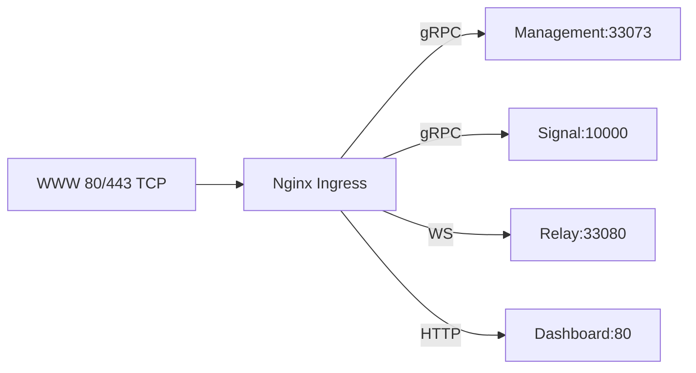

# netbird-management

  

A Helm chart for an easier NetBird management stack (https://netbird.io) deployment at kubernetes.

**Homepage:** <https://github.com/CodeAdminDe/helm-charts>

## Maintainers

| Name | Email | Url |
| ---- | ------ | --- |
| Frederic Roggon | <frederic.roggon@codeadmin.de> | <https://github.com/CodeAdminDe> |

## Requirements

| Repository | Name | Version |
|------------|------|---------|
| https://codeadminde.github.io/helm-charts | libchart-cnps(libchart-cnps) | 0.2.1 |

## TL;DR

You don't want to read through the docs? That's the quick and dirty way:

```bash
helm repo add codeadminde https://codeadminde.github.io/helm-charts/
helm repo update
helm install netbird-management codeadminde/netbird-management
```
_**Note**: If you want to specify a namespace, provide the name via the `-n` (or `--namespace`) flag. You need to create the desired namespace beforehand._

> I'd recommend reading through the docs. Skip them at your own risk. ;-)

## Repository

In order to install / query / etc... the charts, you'll need to add the repository:

```bash
helm repo add codeadminde https://codeadminde.github.io/helm-charts/
helm repo update
```

## Installation

To install the chart with the release name `netbird-management`

```bash
helm install netbird-management codeadminde/netbird-management
```
_**Note**: If you want to specify a namespace, provide the name via the `-n` (or `--namespace`) flag. You need to create the desired namespace beforehand._

## Uninstallation

To uninstall the chart release named `netbird-management`

```bash
helm uninstall netbird-management
```
_**Note**: If you want to specify a namespace, provide the name via the `-n` (or `--namespace`) flag. You need to create the desired namespace beforehand._

The command removes all the Kubernetes components associated with the chart **including persistent volumes** and deletes the release.

## Configuration

Take a look at the [values.yaml](./values.yaml) file of the chart. It contains the default configuration and additional notes.
So it would be a good idea to take a look at it, even if you already know what you would like to accomplish.

To configure the release (chart values), provide your own values via a *.yaml file and reference it with the `-f` flag.

> #### Sample
>
> ```bash
> helm install netbird-management codeadminde/netbird-management -f values.yaml
> ```

Alternatively, you could provide the values which you want to override at the CLI directly. Then you have to provide the values as key=value pair(s), referenced by the `--set` flag.

> #### Sample
>
> ```bash
> helm install netbird-management --set key=value --set keyTwo=secondValue codeadminde/netbird-management
> ```

## Values

<table height="800px" >
	<thead>
		<th>Key</th>
		<th>Type</th>
		<th>Default</th>
		<th>Description</th>
	</thead>
	<tbody>
		<tr>
			<td id="auth"><a href="./values.yaml#L34">auth</a></td>
			<td>
object
</td>
			<td>
				<div style="max-width: 300px;">
<pre lang="json">
{
  "embeddedIdp": {
    "dataDir": "/var/lib/netbird/idp",
    "enabled": false
  },
  "externalProviders": {
    "apiJob": {
      "enabled": false,
      "image": {
        "pullPolicy": "Always",
        "repository": "ghcr.io/codeadminde/alpine-toolbox",
        "tag": "latest"
      },
      "managementUrl": "",
      "payloadSecretKey": "payload.json",
      "payloadSecretName": "",
      "tokenSecretKey": "token",
      "tokenSecretName": ""
    },
    "managedBy": {
      "mode": "helm"
    }
  },
  "localAuth": {
    "localAuthDisabled": false
  }
}
</pre>
</div>
			</td>
			<td>Authentication / Identity Provider configuration</td>
		</tr>
		<tr>
			<td id="auth--embeddedIdp--dataDir"><a href="./values.yaml#L39">auth.embeddedIdp.dataDir</a></td>
			<td>
string
</td>
			<td>
				<div style="max-width: 300px;">
<pre lang="json">
"/var/lib/netbird/idp"
</pre>
</div>
			</td>
			<td>Data directory inside the container (mapped via PVC)</td>
		</tr>
		<tr>
			<td id="auth--embeddedIdp--enabled"><a href="./values.yaml#L37">auth.embeddedIdp.enabled</a></td>
			<td>
bool
</td>
			<td>
				<div style="max-width: 300px;">
<pre lang="json">
false
</pre>
</div>
			</td>
			<td>Enable embedded IdP (Dex) inside NetBird (recommended for new self-hosted setups)</td>
		</tr>
		<tr>
			<td id="auth--externalProviders--apiJob--enabled"><a href="./values.yaml#L50">auth.externalProviders.apiJob.enabled</a></td>
			<td>
bool
</td>
			<td>
				<div style="max-width: 300px;">
<pre lang="json">
false
</pre>
</div>
			</td>
			<td>Enable an API job to configure external IdPs (combined mode recommended)</td>
		</tr>
		<tr>
			<td id="auth--externalProviders--apiJob--image"><a href="./values.yaml#L52">auth.externalProviders.apiJob.image</a></td>
			<td>
object
</td>
			<td>
				<div style="max-width: 300px;">
<pre lang="json">
{
  "pullPolicy": "Always",
  "repository": "ghcr.io/codeadminde/alpine-toolbox",
  "tag": "latest"
}
</pre>
</div>
			</td>
			<td>Job image repository, tag and pullPolicy</td>
		</tr>
		<tr>
			<td id="auth--externalProviders--apiJob--managementUrl"><a href="./values.yaml#L57">auth.externalProviders.apiJob.managementUrl</a></td>
			<td>
string
</td>
			<td>
				<div style="max-width: 300px;">
<pre lang="json">
""
</pre>
</div>
			</td>
			<td>Base management URL (example: https://nb.example.com)</td>
		</tr>
		<tr>
			<td id="auth--externalProviders--apiJob--payloadSecretKey"><a href="./values.yaml#L65">auth.externalProviders.apiJob.payloadSecretKey</a></td>
			<td>
string
</td>
			<td>
				<div style="max-width: 300px;">
<pre lang="json">
"payload.json"
</pre>
</div>
			</td>
			<td>Key inside the payload secret</td>
		</tr>
		<tr>
			<td id="auth--externalProviders--apiJob--payloadSecretName"><a href="./values.yaml#L63">auth.externalProviders.apiJob.payloadSecretName</a></td>
			<td>
string
</td>
			<td>
				<div style="max-width: 300px;">
<pre lang="json">
""
</pre>
</div>
			</td>
			<td>Secret containing the JSON payload for /api/identity-providers (single object)</td>
		</tr>
		<tr>
			<td id="auth--externalProviders--apiJob--tokenSecretKey"><a href="./values.yaml#L61">auth.externalProviders.apiJob.tokenSecretKey</a></td>
			<td>
string
</td>
			<td>
				<div style="max-width: 300px;">
<pre lang="json">
"token"
</pre>
</div>
			</td>
			<td>Key inside the token secret</td>
		</tr>
		<tr>
			<td id="auth--externalProviders--apiJob--tokenSecretName"><a href="./values.yaml#L59">auth.externalProviders.apiJob.tokenSecretName</a></td>
			<td>
string
</td>
			<td>
				<div style="max-width: 300px;">
<pre lang="json">
""
</pre>
</div>
			</td>
			<td>Secret containing a management API token</td>
		</tr>
		<tr>
			<td id="auth--externalProviders--managedBy"><a href="./values.yaml#L45">auth.externalProviders.managedBy</a></td>
			<td>
object
</td>
			<td>
				<div style="max-width: 300px;">
<pre lang="json">
{
  "mode": "helm"
}
</pre>
</div>
			</td>
			<td>Configure external IdPs via API/UI or legacy Helm-driven config</td>
		</tr>
		<tr>
			<td id="auth--externalProviders--managedBy--mode"><a href="./values.yaml#L47">auth.externalProviders.managedBy.mode</a></td>
			<td>
string
</td>
			<td>
				<div style="max-width: 300px;">
<pre lang="json">
"helm"
</pre>
</div>
			</td>
			<td>"helm" keeps legacy IdpManagerConfig templating. "api" expects UI/API configuration.</td>
		</tr>
		<tr>
			<td id="auth--localAuth--localAuthDisabled"><a href="./values.yaml#L42">auth.localAuth.localAuthDisabled</a></td>
			<td>
bool
</td>
			<td>
				<div style="max-width: 300px;">
<pre lang="json">
false
</pre>
</div>
			</td>
			<td>Disable local user authentication (server.auth.localAuthDisabled)</td>
		</tr>
		<tr>
			<td id="authentik"><a href="./values.yaml#L509">authentik</a></td>
			<td>
object
</td>
			<td>
				<div style="max-width: 300px;">
<pre lang="json">
{
  "appSlug": "de_example_nb",
  "clientId": "your-client-id",
  "clientSecret": "",
  "device": {
    "clientId": "your-client-id",
    "clientSecret": "",
    "isPublicClient": true,
    "scopes": "openid",
    "type": "hosted",
    "useIdToken": false
  },
  "domain": "https://auth.example.com",
  "enabled": true,
  "isPublicClient": true,
  "issuer": "https://auth.example.com",
  "scopes": "openid profile email offline_access api",
  "serviceAccount": {
    "password": "",
    "username": "netbird"
  },
  "useIdToken": false
}
</pre>
</div>
			</td>
			<td>Authentik OIDC configuration (legacy mode + managedBy.helm)</td>
		</tr>
		<tr>
			<td id="authentik--appSlug"><a href="./values.yaml#L515">authentik.appSlug</a></td>
			<td>
string
</td>
			<td>
				<div style="max-width: 300px;">
<pre lang="json">
"de_example_nb"
</pre>
</div>
			</td>
			<td>Authentik application slug</td>
		</tr>
		<tr>
			<td id="authentik--clientId"><a href="./values.yaml#L521">authentik.clientId</a></td>
			<td>
string
</td>
			<td>
				<div style="max-width: 300px;">
<pre lang="json">
"your-client-id"
</pre>
</div>
			</td>
			<td>Authentik client ID</td>
		</tr>
		<tr>
			<td id="authentik--clientSecret"><a href="./values.yaml#L524">authentik.clientSecret</a></td>
			<td>
string
</td>
			<td>
				<div style="max-width: 300px;">
<pre lang="json">
""
</pre>
</div>
			</td>
			<td>Authentik client secret (only required for confidential clients) @description Sensitive: prefer existingAuthentikOidcSecret / existingAuthentikDeviceOidcSecret or external secret managers. Leaving this empty uses the chart's secret fallback.</td>
		</tr>
		<tr>
			<td id="authentik--device"><a href="./values.yaml#L537">authentik.device</a></td>
			<td>
object
</td>
			<td>
				<div style="max-width: 300px;">
<pre lang="json">
{
  "clientId": "your-client-id",
  "clientSecret": "",
  "isPublicClient": true,
  "scopes": "openid",
  "type": "hosted",
  "useIdToken": false
}
</pre>
</div>
			</td>
			<td>Device code flow configuration</td>
		</tr>
		<tr>
			<td id="authentik--device--clientId"><a href="./values.yaml#L543">authentik.device.clientId</a></td>
			<td>
string
</td>
			<td>
				<div style="max-width: 300px;">
<pre lang="json">
"your-client-id"
</pre>
</div>
			</td>
			<td>Device code flow client ID</td>
		</tr>
		<tr>
			<td id="authentik--device--clientSecret"><a href="./values.yaml#L546">authentik.device.clientSecret</a></td>
			<td>
string
</td>
			<td>
				<div style="max-width: 300px;">
<pre lang="json">
""
</pre>
</div>
			</td>
			<td>Device code flow client secret (only required for confidential clients) @description Sensitive: prefer existingAuthentikDeviceOidcSecret or external secret managers. Leaving this empty uses the chart's secret fallback.</td>
		</tr>
		<tr>
			<td id="authentik--device--isPublicClient"><a href="./values.yaml#L541">authentik.device.isPublicClient</a></td>
			<td>
bool
</td>
			<td>
				<div style="max-width: 300px;">
<pre lang="json">
true
</pre>
</div>
			</td>
			<td>Device code flow client is public</td>
		</tr>
		<tr>
			<td id="authentik--device--scopes"><a href="./values.yaml#L548">authentik.device.scopes</a></td>
			<td>
string
</td>
			<td>
				<div style="max-width: 300px;">
<pre lang="json">
"openid"
</pre>
</div>
			</td>
			<td>Device code flow OIDC scopes</td>
		</tr>
		<tr>
			<td id="authentik--device--type"><a href="./values.yaml#L539">authentik.device.type</a></td>
			<td>
string
</td>
			<td>
				<div style="max-width: 300px;">
<pre lang="json">
"hosted"
</pre>
</div>
			</td>
			<td>Device code flow type (hosted or none to disable)</td>
		</tr>
		<tr>
			<td id="authentik--device--useIdToken"><a href="./values.yaml#L550">authentik.device.useIdToken</a></td>
			<td>
bool
</td>
			<td>
				<div style="max-width: 300px;">
<pre lang="json">
false
</pre>
</div>
			</td>
			<td>Use ID token instead of access token for device flow</td>
		</tr>
		<tr>
			<td id="authentik--domain"><a href="./values.yaml#L513">authentik.domain</a></td>
			<td>
string
</td>
			<td>
				<div style="max-width: 300px;">
<pre lang="json">
"https://auth.example.com"
</pre>
</div>
			</td>
			<td>Authentik domain URL</td>
		</tr>
		<tr>
			<td id="authentik--enabled"><a href="./values.yaml#L511">authentik.enabled</a></td>
			<td>
bool
</td>
			<td>
				<div style="max-width: 300px;">
<pre lang="json">
true
</pre>
</div>
			</td>
			<td>Enable Authentik OIDC</td>
		</tr>
		<tr>
			<td id="authentik--isPublicClient"><a href="./values.yaml#L519">authentik.isPublicClient</a></td>
			<td>
bool
</td>
			<td>
				<div style="max-width: 300px;">
<pre lang="json">
true
</pre>
</div>
			</td>
			<td>Authentik client is public (no client secret required)</td>
		</tr>
		<tr>
			<td id="authentik--issuer"><a href="./values.yaml#L517">authentik.issuer</a></td>
			<td>
string
</td>
			<td>
				<div style="max-width: 300px;">
<pre lang="json">
"https://auth.example.com"
</pre>
</div>
			</td>
			<td>Authentik issuer URL</td>
		</tr>
		<tr>
			<td id="authentik--scopes"><a href="./values.yaml#L526">authentik.scopes</a></td>
			<td>
string
</td>
			<td>
				<div style="max-width: 300px;">
<pre lang="json">
"openid profile email offline_access api"
</pre>
</div>
			</td>
			<td>OIDC scopes to request</td>
		</tr>
		<tr>
			<td id="authentik--serviceAccount"><a href="./values.yaml#L530">authentik.serviceAccount</a></td>
			<td>
object
</td>
			<td>
				<div style="max-width: 300px;">
<pre lang="json">
{
  "password": "",
  "username": "netbird"
}
</pre>
</div>
			</td>
			<td>Service account configuration</td>
		</tr>
		<tr>
			<td id="authentik--serviceAccount--password"><a href="./values.yaml#L535">authentik.serviceAccount.password</a></td>
			<td>
string
</td>
			<td>
				<div style="max-width: 300px;">
<pre lang="json">
""
</pre>
</div>
			</td>
			<td>Service account password @description Sensitive: prefer existingAuthentikOidcSecret or external secret managers. Leaving this empty uses the chart's secret fallback.</td>
		</tr>
		<tr>
			<td id="authentik--serviceAccount--username"><a href="./values.yaml#L532">authentik.serviceAccount.username</a></td>
			<td>
string
</td>
			<td>
				<div style="max-width: 300px;">
<pre lang="json">
"netbird"
</pre>
</div>
			</td>
			<td>Service account username</td>
		</tr>
		<tr>
			<td id="authentik--useIdToken"><a href="./values.yaml#L528">authentik.useIdToken</a></td>
			<td>
bool
</td>
			<td>
				<div style="max-width: 300px;">
<pre lang="json">
false
</pre>
</div>
			</td>
			<td>Use ID token instead of access token</td>
		</tr>
		<tr>
			<td id="cnps"><a href="./values.yaml#L613">cnps</a></td>
			<td>
object
</td>
			<td>
				<div style="max-width: 300px;">
<pre lang="json">
{
  "appTraffic": {
    "egress": {
      "allow": true,
      "matchLabels": {},
      "toEntities": []
    },
    "ingress": {
      "allow": true,
      "matchLabels": {},
      "metrics": {
        "matchLabels": {}
      }
    }
  },
  "cnpgTraffic": {
    "instanceExtraEgress": []
  }
}
</pre>
</div>
			</td>
			<td>Application-specific Cilium Network Policies configuration @description Requires CiliumNetworkPolicies library-chart. These settings will be ignored if the library-chart is not available. These settings are directly related to the application and will not influence namespace-wide policies (e.g., for DNS egress traffic).</td>
		</tr>
		<tr>
			<td id="cnps--appTraffic"><a href="./values.yaml#L615">cnps.appTraffic</a></td>
			<td>
object
</td>
			<td>
				<div style="max-width: 300px;">
<pre lang="json">
{
  "egress": {
    "allow": true,
    "matchLabels": {},
    "toEntities": []
  },
  "ingress": {
    "allow": true,
    "matchLabels": {},
    "metrics": {
      "matchLabels": {}
    }
  }
}
</pre>
</div>
			</td>
			<td>Application traffic policies</td>
		</tr>
		<tr>
			<td id="cnps--appTraffic--egress"><a href="./values.yaml#L634">cnps.appTraffic.egress</a></td>
			<td>
object
</td>
			<td>
				<div style="max-width: 300px;">
<pre lang="json">
{
  "allow": true,
  "matchLabels": {},
  "toEntities": []
}
</pre>
</div>
			</td>
			<td>Egress traffic configuration</td>
		</tr>
		<tr>
			<td id="cnps--appTraffic--egress--allow"><a href="./values.yaml#L636">cnps.appTraffic.egress.allow</a></td>
			<td>
bool
</td>
			<td>
				<div style="max-width: 300px;">
<pre lang="json">
true
</pre>
</div>
			</td>
			<td>Allow egress traffic</td>
		</tr>
		<tr>
			<td id="cnps--appTraffic--egress--matchLabels"><a href="./values.yaml#L639">cnps.appTraffic.egress.matchLabels</a></td>
			<td>
object
</td>
			<td>
				<div style="max-width: 300px;">
<pre lang="json">
{}
</pre>
</div>
			</td>
			<td>Labels to match egress destinations @description Allows overriding default egress labels to match your security requirements.</td>
		</tr>
		<tr>
			<td id="cnps--appTraffic--egress--toEntities"><a href="./values.yaml#L643">cnps.appTraffic.egress.toEntities</a></td>
			<td>
list
</td>
			<td>
				<div style="max-width: 300px;">
<pre lang="json">
[]
</pre>
</div>
			</td>
			<td>Entities to allow egress to (e.g., world) @description Allows overriding default egress entities to match your security requirements.   - world</td>
		</tr>
		<tr>
			<td id="cnps--appTraffic--ingress"><a href="./values.yaml#L617">cnps.appTraffic.ingress</a></td>
			<td>
object
</td>
			<td>
				<div style="max-width: 300px;">
<pre lang="json">
{
  "allow": true,
  "matchLabels": {},
  "metrics": {
    "matchLabels": {}
  }
}
</pre>
</div>
			</td>
			<td>Ingress traffic configuration</td>
		</tr>
		<tr>
			<td id="cnps--appTraffic--ingress--allow"><a href="./values.yaml#L619">cnps.appTraffic.ingress.allow</a></td>
			<td>
bool
</td>
			<td>
				<div style="max-width: 300px;">
<pre lang="json">
true
</pre>
</div>
			</td>
			<td>Allow ingress traffic</td>
		</tr>
		<tr>
			<td id="cnps--appTraffic--ingress--matchLabels"><a href="./values.yaml#L624">cnps.appTraffic.ingress.matchLabels</a></td>
			<td>
object
</td>
			<td>
				<div style="max-width: 300px;">
<pre lang="json">
{}
</pre>
</div>
			</td>
			<td>Labels to match ingress controller pods @description Allows overriding default to match your ingress deployment.   app.kubernetes.io/name: ingress-nginx   io.kubernetes.pod.namespace: ingress-nginx</td>
		</tr>
		<tr>
			<td id="cnps--appTraffic--ingress--metrics"><a href="./values.yaml#L626">cnps.appTraffic.ingress.metrics</a></td>
			<td>
object
</td>
			<td>
				<div style="max-width: 300px;">
<pre lang="json">
{
  "matchLabels": {}
}
</pre>
</div>
			</td>
			<td>Metrics scraper configuration</td>
		</tr>
		<tr>
			<td id="cnps--appTraffic--ingress--metrics--matchLabels"><a href="./values.yaml#L632">cnps.appTraffic.ingress.metrics.matchLabels</a></td>
			<td>
object
</td>
			<td>
				<div style="max-width: 300px;">
<pre lang="json">
{}
</pre>
</div>
			</td>
			<td>Labels to match Prometheus pods @description Allows overriding default to match your prometheus deployment   app.kubernetes.io/name: prometheus   app.kubernetes.io/instance: kube-prometheus-stack-prometheus   io.kubernetes.pod.namespace: monitoring--kube-prometheus-stack</td>
		</tr>
		<tr>
			<td id="cnps--cnpgTraffic"><a href="./values.yaml#L645">cnps.cnpgTraffic</a></td>
			<td>
object
</td>
			<td>
				<div style="max-width: 300px;">
<pre lang="json">
{
  "instanceExtraEgress": []
}
</pre>
</div>
			</td>
			<td>CNPG traffic policies</td>
		</tr>
		<tr>
			<td id="cnps--cnpgTraffic--instanceExtraEgress"><a href="./values.yaml#L663">cnps.cnpgTraffic.instanceExtraEgress</a></td>
			<td>
list
</td>
			<td>
				<div style="max-width: 300px;">
<pre lang="json">
[]
</pre>
</div>
			</td>
			<td>Additional instance egress rules for external services (e.g., backup services) @description Add additional rule(s) as desired, to allow access to external backup services - toFQDNs:   - matchName: s3.storage.example.org   toPorts:     - ports:         - port: "443"           protocol: TCP ## OR ## - toEntities:   - world   toPorts:     - ports:         - port: "8443"           protocol: TCP ## OR ## ...</td>
		</tr>
		<tr>
			<td id="dashboard"><a href="./values.yaml#L408">dashboard</a></td>
			<td>
object
</td>
			<td>
				<div style="max-width: 300px;">
<pre lang="json">
{
  "auth": {
    "autoEmbedded": true,
    "clientId": "",
    "embeddedClientId": "netbird-dashboard",
    "existingSecretKey": "client-secret",
    "existingSecretName": "",
    "issuer": "",
    "mode": "legacy",
    "scopes": "openid profile email offline_access",
    "tokenSource": "accessToken"
  },
  "enabled": true,
  "hpa": {
    "enabled": false,
    "maxReplicas": 10,
    "minReplicas": 2,
    "targetCPUUtilizationPercentage": 70
  },
  "image": {
    "pullPolicy": "IfNotPresent",
    "repository": "netbirdio/dashboard",
    "tag": "v2.33.0"
  },
  "metricsPort": 9090,
  "port": 80,
  "replicaCount": 1,
  "resources": {
    "limits": {
      "cpu": "200m",
      "memory": "256Mi"
    },
    "requests": {
      "cpu": "50m",
      "memory": "64Mi"
    }
  },
  "service": {
    "metricsPort": 9090,
    "port": 80,
    "type": "ClusterIP"
  }
}
</pre>
</div>
			</td>
			<td>Dashboard UI</td>
		</tr>
		<tr>
			<td id="dashboard--auth--autoEmbedded"><a href="./values.yaml#L456">dashboard.auth.autoEmbedded</a></td>
			<td>
bool
</td>
			<td>
				<div style="max-width: 300px;">
<pre lang="json">
true
</pre>
</div>
			</td>
			<td>Auto-configure dashboard for embedded IdP when mode.architecture is "combined" @description When enabled and mode.architecture=combined, the chart uses embedded IdP defaults for issuer/client.</td>
		</tr>
		<tr>
			<td id="dashboard--auth--clientId"><a href="./values.yaml#L462">dashboard.auth.clientId</a></td>
			<td>
string
</td>
			<td>
				<div style="max-width: 300px;">
<pre lang="json">
""
</pre>
</div>
			</td>
			<td>Client ID for the dashboard</td>
		</tr>
		<tr>
			<td id="dashboard--auth--embeddedClientId"><a href="./values.yaml#L458">dashboard.auth.embeddedClientId</a></td>
			<td>
string
</td>
			<td>
				<div style="max-width: 300px;">
<pre lang="json">
"netbird-dashboard"
</pre>
</div>
			</td>
			<td>Embedded IdP dashboard client ID/audience (used only when autoEmbedded is true)</td>
		</tr>
		<tr>
			<td id="dashboard--auth--existingSecretKey"><a href="./values.yaml#L466">dashboard.auth.existingSecretKey</a></td>
			<td>
string
</td>
			<td>
				<div style="max-width: 300px;">
<pre lang="json">
"client-secret"
</pre>
</div>
			</td>
			<td>Secret key holding the client secret</td>
		</tr>
		<tr>
			<td id="dashboard--auth--existingSecretName"><a href="./values.yaml#L464">dashboard.auth.existingSecretName</a></td>
			<td>
string
</td>
			<td>
				<div style="max-width: 300px;">
<pre lang="json">
""
</pre>
</div>
			</td>
			<td>Existing secret with client secret (optional)</td>
		</tr>
		<tr>
			<td id="dashboard--auth--issuer"><a href="./values.yaml#L460">dashboard.auth.issuer</a></td>
			<td>
string
</td>
			<td>
				<div style="max-width: 300px;">
<pre lang="json">
""
</pre>
</div>
			</td>
			<td>OIDC issuer URL (defaults to https://{global.domain}/oauth2 when embedded auth is auto-configured)</td>
		</tr>
		<tr>
			<td id="dashboard--auth--mode"><a href="./values.yaml#L453">dashboard.auth.mode</a></td>
			<td>
string
</td>
			<td>
				<div style="max-width: 300px;">
<pre lang="json">
"legacy"
</pre>
</div>
			</td>
			<td>Auth mode: "legacy" (use authentik.*) or "custom" (explicit values below)</td>
		</tr>
		<tr>
			<td id="dashboard--auth--scopes"><a href="./values.yaml#L468">dashboard.auth.scopes</a></td>
			<td>
string
</td>
			<td>
				<div style="max-width: 300px;">
<pre lang="json">
"openid profile email offline_access"
</pre>
</div>
			</td>
			<td>OIDC scopes to request</td>
		</tr>
		<tr>
			<td id="dashboard--auth--tokenSource"><a href="./values.yaml#L470">dashboard.auth.tokenSource</a></td>
			<td>
string
</td>
			<td>
				<div style="max-width: 300px;">
<pre lang="json">
"accessToken"
</pre>
</div>
			</td>
			<td>Token source (accessToken or idToken)</td>
		</tr>
		<tr>
			<td id="dashboard--enabled"><a href="./values.yaml#L410">dashboard.enabled</a></td>
			<td>
bool
</td>
			<td>
				<div style="max-width: 300px;">
<pre lang="json">
true
</pre>
</div>
			</td>
			<td>Enable Dashboard</td>
		</tr>
		<tr>
			<td id="dashboard--hpa"><a href="./values.yaml#L442">dashboard.hpa</a></td>
			<td>
object
</td>
			<td>
				<div style="max-width: 300px;">
<pre lang="json">
{
  "enabled": false,
  "maxReplicas": 10,
  "minReplicas": 2,
  "targetCPUUtilizationPercentage": 70
}
</pre>
</div>
			</td>
			<td>Horizontal Pod Autoscaler configuration</td>
		</tr>
		<tr>
			<td id="dashboard--hpa--enabled"><a href="./values.yaml#L444">dashboard.hpa.enabled</a></td>
			<td>
bool
</td>
			<td>
				<div style="max-width: 300px;">
<pre lang="json">
false
</pre>
</div>
			</td>
			<td>Enable HPA</td>
		</tr>
		<tr>
			<td id="dashboard--hpa--maxReplicas"><a href="./values.yaml#L448">dashboard.hpa.maxReplicas</a></td>
			<td>
int
</td>
			<td>
				<div style="max-width: 300px;">
<pre lang="json">
10
</pre>
</div>
			</td>
			<td>Maximum replicas for HPA</td>
		</tr>
		<tr>
			<td id="dashboard--hpa--minReplicas"><a href="./values.yaml#L446">dashboard.hpa.minReplicas</a></td>
			<td>
int
</td>
			<td>
				<div style="max-width: 300px;">
<pre lang="json">
2
</pre>
</div>
			</td>
			<td>Minimum replicas for HPA</td>
		</tr>
		<tr>
			<td id="dashboard--hpa--targetCPUUtilizationPercentage"><a href="./values.yaml#L450">dashboard.hpa.targetCPUUtilizationPercentage</a></td>
			<td>
int
</td>
			<td>
				<div style="max-width: 300px;">
<pre lang="json">
70
</pre>
</div>
			</td>
			<td>Target CPU utilization percentage</td>
		</tr>
		<tr>
			<td id="dashboard--image"><a href="./values.yaml#L414">dashboard.image</a></td>
			<td>
object
</td>
			<td>
				<div style="max-width: 300px;">
<pre lang="json">
{
  "pullPolicy": "IfNotPresent",
  "repository": "netbirdio/dashboard",
  "tag": "v2.33.0"
}
</pre>
</div>
			</td>
			<td>Dashboard image repository, tag and pullPolicy</td>
		</tr>
		<tr>
			<td id="dashboard--metricsPort"><a href="./values.yaml#L421">dashboard.metricsPort</a></td>
			<td>
int
</td>
			<td>
				<div style="max-width: 300px;">
<pre lang="json">
9090
</pre>
</div>
			</td>
			<td>Dashboard metrics port</td>
		</tr>
		<tr>
			<td id="dashboard--port"><a href="./values.yaml#L419">dashboard.port</a></td>
			<td>
int
</td>
			<td>
				<div style="max-width: 300px;">
<pre lang="json">
80
</pre>
</div>
			</td>
			<td>Dashboard port</td>
		</tr>
		<tr>
			<td id="dashboard--replicaCount"><a href="./values.yaml#L412">dashboard.replicaCount</a></td>
			<td>
int
</td>
			<td>
				<div style="max-width: 300px;">
<pre lang="json">
1
</pre>
</div>
			</td>
			<td>Number of Dashboard replicas</td>
		</tr>
		<tr>
			<td id="dashboard--resources"><a href="./values.yaml#L430">dashboard.resources</a></td>
			<td>
object
</td>
			<td>
				<div style="max-width: 300px;">
<pre lang="json">
{
  "limits": {
    "cpu": "200m",
    "memory": "256Mi"
  },
  "requests": {
    "cpu": "50m",
    "memory": "64Mi"
  }
}
</pre>
</div>
			</td>
			<td>Resource requests and limits</td>
		</tr>
		<tr>
			<td id="dashboard--resources--limits--cpu"><a href="./values.yaml#L438">dashboard.resources.limits.cpu</a></td>
			<td>
string
</td>
			<td>
				<div style="max-width: 300px;">
<pre lang="json">
"200m"
</pre>
</div>
			</td>
			<td>CPU limit</td>
		</tr>
		<tr>
			<td id="dashboard--resources--limits--memory"><a href="./values.yaml#L440">dashboard.resources.limits.memory</a></td>
			<td>
string
</td>
			<td>
				<div style="max-width: 300px;">
<pre lang="json">
"256Mi"
</pre>
</div>
			</td>
			<td>Memory limit</td>
		</tr>
		<tr>
			<td id="dashboard--resources--requests--cpu"><a href="./values.yaml#L433">dashboard.resources.requests.cpu</a></td>
			<td>
string
</td>
			<td>
				<div style="max-width: 300px;">
<pre lang="json">
"50m"
</pre>
</div>
			</td>
			<td>CPU request</td>
		</tr>
		<tr>
			<td id="dashboard--resources--requests--memory"><a href="./values.yaml#L435">dashboard.resources.requests.memory</a></td>
			<td>
string
</td>
			<td>
				<div style="max-width: 300px;">
<pre lang="json">
"64Mi"
</pre>
</div>
			</td>
			<td>Memory request</td>
		</tr>
		<tr>
			<td id="dashboard--service--metricsPort"><a href="./values.yaml#L428">dashboard.service.metricsPort</a></td>
			<td>
int
</td>
			<td>
				<div style="max-width: 300px;">
<pre lang="json">
9090
</pre>
</div>
			</td>
			<td>Service metrics port</td>
		</tr>
		<tr>
			<td id="dashboard--service--port"><a href="./values.yaml#L426">dashboard.service.port</a></td>
			<td>
int
</td>
			<td>
				<div style="max-width: 300px;">
<pre lang="json">
80
</pre>
</div>
			</td>
			<td>Service port</td>
		</tr>
		<tr>
			<td id="dashboard--service--type"><a href="./values.yaml#L424">dashboard.service.type</a></td>
			<td>
string
</td>
			<td>
				<div style="max-width: 300px;">
<pre lang="json">
"ClusterIP"
</pre>
</div>
			</td>
			<td>Service type</td>
		</tr>
		<tr>
			<td id="encryption"><a href="./values.yaml#L490">encryption</a></td>
			<td>
object
</td>
			<td>
				<div style="max-width: 300px;">
<pre lang="json">
{
  "enforceExternalInProduction": false,
  "immutableSecrets": false
}
</pre>
</div>
			</td>
			<td>Encryption key enforcement and safety</td>
		</tr>
		<tr>
			<td id="encryption--enforceExternalInProduction"><a href="./values.yaml#L492">encryption.enforceExternalInProduction</a></td>
			<td>
bool
</td>
			<td>
				<div style="max-width: 300px;">
<pre lang="json">
false
</pre>
</div>
			</td>
			<td>Require existingEncryptionKeySecret in production environments</td>
		</tr>
		<tr>
			<td id="encryption--immutableSecrets"><a href="./values.yaml#L494">encryption.immutableSecrets</a></td>
			<td>
bool
</td>
			<td>
				<div style="max-width: 300px;">
<pre lang="json">
false
</pre>
</div>
			</td>
			<td>Set immutable: true on generated encryption secrets</td>
		</tr>
		<tr>
			<td id="existingAuthentikDeviceOidcSecret"><a href="./values.yaml#L506">existingAuthentikDeviceOidcSecret</a></td>
			<td>
string
</td>
			<td>
				<div style="max-width: 300px;">
<pre lang="json">
""
</pre>
</div>
			</td>
			<td>Existing Authentik device OIDC secret @description If not provided, Helm creates it automatically on first install based on provided values. Configured to not roll-over on upgrades to avoid breaking decryption on release upgrades.</td>
		</tr>
		<tr>
			<td id="existingAuthentikOidcSecret"><a href="./values.yaml#L502">existingAuthentikOidcSecret</a></td>
			<td>
string
</td>
			<td>
				<div style="max-width: 300px;">
<pre lang="json">
""
</pre>
</div>
			</td>
			<td>Existing Authentik OIDC secret @description If not provided, Helm creates it automatically on first install based on provided values. Configured to not roll-over on upgrades to avoid breaking decryption on release upgrades.</td>
		</tr>
		<tr>
			<td id="existingEncryptionKeySecret"><a href="./values.yaml#L487">existingEncryptionKeySecret</a></td>
			<td>
string
</td>
			<td>
				<div style="max-width: 300px;">
<pre lang="json">
""
</pre>
</div>
			</td>
			<td>Existing encryption key secret @description Generate a secret with `openssl rand -base64 32` and pre-deploy a secret containing the value with key `encryptionKey`. If not provided, Helm creates it automatically on first install. Configured to not roll-over on upgrades to avoid breaking decryption on release upgrades.</td>
		</tr>
		<tr>
			<td id="existingRelayAuthSecret"><a href="./values.yaml#L498">existingRelayAuthSecret</a></td>
			<td>
string
</td>
			<td>
				<div style="max-width: 300px;">
<pre lang="json">
""
</pre>
</div>
			</td>
			<td>Existing relay authentication secret @description If not provided, Helm creates it automatically on first install. Configured to not roll-over on upgrades to avoid breaking decryption on release upgrades.</td>
		</tr>
		<tr>
			<td id="global"><a href="./values.yaml#L2">global</a></td>
			<td>
object
</td>
			<td>
				<div style="max-width: 300px;">
<pre lang="json">
{
  "caDebugOutput": false,
  "disableAnonMetrics": false,
  "domain": "nb.example.com",
  "environment": "production",
  "imagePullSecrets": [],
  "nbDnsDomain": "netbird.selfhosted",
  "relayDomains": [],
  "timezone": "UTC"
}
</pre>
</div>
			</td>
			<td>Global Configuration</td>
		</tr>
		<tr>
			<td id="global--caDebugOutput"><a href="./values.yaml#L26">global.caDebugOutput</a></td>
			<td>
bool
</td>
			<td>
				<div style="max-width: 300px;">
<pre lang="json">
false
</pre>
</div>
			</td>
			<td>Enable / Disable debug output. @description WARN: When enabled, debug output will leak credentials and/or secrets into logs. Do not enable in prod envs!</td>
		</tr>
		<tr>
			<td id="global--disableAnonMetrics"><a href="./values.yaml#L21">global.disableAnonMetrics</a></td>
			<td>
bool
</td>
			<td>
				<div style="max-width: 300px;">
<pre lang="json">
false
</pre>
</div>
			</td>
			<td>Enable / Disable anonymous metrics collection</td>
		</tr>
		<tr>
			<td id="global--domain"><a href="./values.yaml#L4">global.domain</a></td>
			<td>
string
</td>
			<td>
				<div style="max-width: 300px;">
<pre lang="json">
"nb.example.com"
</pre>
</div>
			</td>
			<td>Domain for the deployment</td>
		</tr>
		<tr>
			<td id="global--environment"><a href="./values.yaml#L15">global.environment</a></td>
			<td>
string
</td>
			<td>
				<div style="max-width: 300px;">
<pre lang="json">
"production"
</pre>
</div>
			</td>
			<td>Environment (production, staging, development)</td>
		</tr>
		<tr>
			<td id="global--imagePullSecrets"><a href="./values.yaml#L19">global.imagePullSecrets</a></td>
			<td>
list
</td>
			<td>
				<div style="max-width: 300px;">
<pre lang="json">
[]
</pre>
</div>
			</td>
			<td>Image pull secrets for private registries</td>
		</tr>
		<tr>
			<td id="global--nbDnsDomain"><a href="./values.yaml#L23">global.nbDnsDomain</a></td>
			<td>
string
</td>
			<td>
				<div style="max-width: 300px;">
<pre lang="json">
"netbird.selfhosted"
</pre>
</div>
			</td>
			<td>DNS domain inside the NetBird VPN</td>
		</tr>
		<tr>
			<td id="global--relayDomains"><a href="./values.yaml#L13">global.relayDomains</a></td>
			<td>
list
</td>
			<td>
				<div style="max-width: 300px;">
<pre lang="json">
[]
</pre>
</div>
			</td>
			<td>Domain list of relay endpoints @description Allowes to configure one or more replay endpoints. Leave empty ([]), to use the global.domain (default behavior). If you'd like your clients to connect to a different and/or multiple relays, provide them as a comma-separated list of strings, including proto, fqdn, port and path. Sample: relayDomains:  - "rels://nb.example.com:443/relay"  - "rels://relay.example.invalid:443/relay"</td>
		</tr>
		<tr>
			<td id="global--timezone"><a href="./values.yaml#L17">global.timezone</a></td>
			<td>
string
</td>
			<td>
				<div style="max-width: 300px;">
<pre lang="json">
"UTC"
</pre>
</div>
			</td>
			<td>Timezone for the deployment</td>
		</tr>
		<tr>
			<td id="ingress"><a href="./values.yaml#L563">ingress</a></td>
			<td>
object
</td>
			<td>
				<div style="max-width: 300px;">
<pre lang="json">
{
  "additionalAnnotations": {},
  "className": "nginx",
  "consolidationMode": "http2",
  "enabled": true,
  "tls": {
    "enabled": true,
    "issuer": {
      "kind": "ClusterIssuer",
      "name": "letsencrypt-prod"
    }
  }
}
</pre>
</div>
			</td>
			<td>Ingress configuration</td>
		</tr>
		<tr>
			<td id="ingress--additionalAnnotations"><a href="./values.yaml#L581">ingress.additionalAnnotations</a></td>
			<td>
object
</td>
			<td>
				<div style="max-width: 300px;">
<pre lang="json">
{}
</pre>
</div>
			</td>
			<td>Optional annotations for Ingress configuration</td>
		</tr>
		<tr>
			<td id="ingress--className"><a href="./values.yaml#L567">ingress.className</a></td>
			<td>
string
</td>
			<td>
				<div style="max-width: 300px;">
<pre lang="json">
"nginx"
</pre>
</div>
			</td>
			<td>Ingress class name</td>
		</tr>
		<tr>
			<td id="ingress--consolidationMode"><a href="./values.yaml#L569">ingress.consolidationMode</a></td>
			<td>
string
</td>
			<td>
				<div style="max-width: 300px;">
<pre lang="json">
"http2"
</pre>
</div>
			</td>
			<td>HTTP/2 consolidation mode</td>
		</tr>
		<tr>
			<td id="ingress--enabled"><a href="./values.yaml#L565">ingress.enabled</a></td>
			<td>
bool
</td>
			<td>
				<div style="max-width: 300px;">
<pre lang="json">
true
</pre>
</div>
			</td>
			<td>Enable Ingress</td>
		</tr>
		<tr>
			<td id="ingress--tls"><a href="./values.yaml#L571">ingress.tls</a></td>
			<td>
object
</td>
			<td>
				<div style="max-width: 300px;">
<pre lang="json">
{
  "enabled": true,
  "issuer": {
    "kind": "ClusterIssuer",
    "name": "letsencrypt-prod"
  }
}
</pre>
</div>
			</td>
			<td>TLS configuration</td>
		</tr>
		<tr>
			<td id="ingress--tls--enabled"><a href="./values.yaml#L573">ingress.tls.enabled</a></td>
			<td>
bool
</td>
			<td>
				<div style="max-width: 300px;">
<pre lang="json">
true
</pre>
</div>
			</td>
			<td>Enable TLS</td>
		</tr>
		<tr>
			<td id="ingress--tls--issuer"><a href="./values.yaml#L575">ingress.tls.issuer</a></td>
			<td>
object
</td>
			<td>
				<div style="max-width: 300px;">
<pre lang="json">
{
  "kind": "ClusterIssuer",
  "name": "letsencrypt-prod"
}
</pre>
</div>
			</td>
			<td>Certificate issuer configuration</td>
		</tr>
		<tr>
			<td id="ingress--tls--issuer--kind"><a href="./values.yaml#L579">ingress.tls.issuer.kind</a></td>
			<td>
string
</td>
			<td>
				<div style="max-width: 300px;">
<pre lang="json">
"ClusterIssuer"
</pre>
</div>
			</td>
			<td>Issuer kind (Issuer or ClusterIssuer)</td>
		</tr>
		<tr>
			<td id="ingress--tls--issuer--name"><a href="./values.yaml#L577">ingress.tls.issuer.name</a></td>
			<td>
string
</td>
			<td>
				<div style="max-width: 300px;">
<pre lang="json">
"letsencrypt-prod"
</pre>
</div>
			</td>
			<td>Issuer name</td>
		</tr>
		<tr>
			<td id="libchartCnps"><a href="./values.yaml#L605">libchartCnps</a></td>
			<td>
object
</td>
			<td>
				<div style="max-width: 300px;">
<pre lang="json">
{
  "enabled": false,
  "includeCnpgPolicies": false
}
</pre>
</div>
			</td>
			<td>Cilium Network Policies configuration</td>
		</tr>
		<tr>
			<td id="libchartCnps--enabled"><a href="./values.yaml#L607">libchartCnps.enabled</a></td>
			<td>
bool
</td>
			<td>
				<div style="max-width: 300px;">
<pre lang="json">
false
</pre>
</div>
			</td>
			<td>Enable Cilium Network Policies</td>
		</tr>
		<tr>
			<td id="libchartCnps--includeCnpgPolicies"><a href="./values.yaml#L609">libchartCnps.includeCnpgPolicies</a></td>
			<td>
bool
</td>
			<td>
				<div style="max-width: 300px;">
<pre lang="json">
false
</pre>
</div>
			</td>
			<td>Include CNPG-specific policies</td>
		</tr>
		<tr>
			<td id="management"><a href="./values.yaml#L68">management</a></td>
			<td>
object
</td>
			<td>
				<div style="max-width: 300px;">
<pre lang="json">
{
  "affinity": {
    "podAntiAffinity": "preferred"
  },
  "enabled": true,
  "idp": {
    "timeout": 10
  },
  "image": {
    "pullPolicy": "IfNotPresent",
    "repository": "netbirdio/management",
    "tag": "0.66.2"
  },
  "initConfig": {
    "image": {
      "pullPolicy": "Always",
      "repository": "ghcr.io/codeadminde/alpine-toolbox",
      "tag": "latest"
    }
  },
  "metricsPort": 9090,
  "netbirdConfigMgmtPort": null,
  "persistence": {
    "accessModes": [
      "ReadWriteOnce"
    ],
    "emptyDirSizeLimit": "100Mi",
    "enabled": true,
    "size": "500Mi",
    "storageClass": "longhorn"
  },
  "podDisruptionBudget": {
    "enabled": true,
    "minAvailable": 1
  },
  "port": 443,
  "probes": {
    "liveness": {
      "enabled": true,
      "failureThreshold": 3,
      "initialDelaySeconds": 30,
      "periodSeconds": 10,
      "timeoutSeconds": 5
    },
    "readiness": {
      "enabled": true,
      "failureThreshold": 2,
      "initialDelaySeconds": 10,
      "periodSeconds": 5,
      "timeoutSeconds": 3
    }
  },
  "replicaCount": 1,
  "resources": {
    "limits": {
      "cpu": "1000m",
      "memory": "1Gi"
    },
    "requests": {
      "cpu": "200m",
      "memory": "256Mi"
    }
  },
  "reverseProxy": {
    "trustedPeers": [
      "0.0.0.0/0"
    ],
    "trustedProxyCount": 0,
    "trustedProxyIps": []
  },
  "securityContext": {
    "fsGroup": 1001,
    "readOnlyRootFilesystem": true,
    "runAsGroup": 1001,
    "runAsNonRoot": true,
    "runAsUser": 1001
  },
  "service": {
    "metricsPort": 9090,
    "port": 33073,
    "type": "ClusterIP"
  },
  "updateStrategy": {
    "type": "RollingUpdate"
  }
}
</pre>
</div>
			</td>
			<td>Management Server - Control Plane</td>
		</tr>
		<tr>
			<td id="management--affinity"><a href="./values.yaml#L160">management.affinity</a></td>
			<td>
object
</td>
			<td>
				<div style="max-width: 300px;">
<pre lang="json">
{
  "podAntiAffinity": "preferred"
}
</pre>
</div>
			</td>
			<td>Pod affinity settings</td>
		</tr>
		<tr>
			<td id="management--affinity--podAntiAffinity"><a href="./values.yaml#L162">management.affinity.podAntiAffinity</a></td>
			<td>
string
</td>
			<td>
				<div style="max-width: 300px;">
<pre lang="json">
"preferred"
</pre>
</div>
			</td>
			<td>Pod anti-affinity strategy (required, preferred)</td>
		</tr>
		<tr>
			<td id="management--enabled"><a href="./values.yaml#L70">management.enabled</a></td>
			<td>
bool
</td>
			<td>
				<div style="max-width: 300px;">
<pre lang="json">
true
</pre>
</div>
			</td>
			<td>Enable Management server</td>
		</tr>
		<tr>
			<td id="management--idp"><a href="./values.yaml#L88">management.idp</a></td>
			<td>
object
</td>
			<td>
				<div style="max-width: 300px;">
<pre lang="json">
{
  "timeout": 10
}
</pre>
</div>
			</td>
			<td>Mangagement specific IdP config</td>
		</tr>
		<tr>
			<td id="management--idp--timeout"><a href="./values.yaml#L90">management.idp.timeout</a></td>
			<td>
int
</td>
			<td>
				<div style="max-width: 300px;">
<pre lang="json">
10
</pre>
</div>
			</td>
			<td>Timeout for IdP requests (default to NetBird inital default of 10)</td>
		</tr>
		<tr>
			<td id="management--image"><a href="./values.yaml#L74">management.image</a></td>
			<td>
object
</td>
			<td>
				<div style="max-width: 300px;">
<pre lang="json">
{
  "pullPolicy": "IfNotPresent",
  "repository": "netbirdio/management",
  "tag": "0.66.2"
}
</pre>
</div>
			</td>
			<td>Management image repository, tag and pullPolicy</td>
		</tr>
		<tr>
			<td id="management--initConfig"><a href="./values.yaml#L79">management.initConfig</a></td>
			<td>
object
</td>
			<td>
				<div style="max-width: 300px;">
<pre lang="json">
{
  "image": {
    "pullPolicy": "Always",
    "repository": "ghcr.io/codeadminde/alpine-toolbox",
    "tag": "latest"
  }
}
</pre>
</div>
			</td>
			<td>Init container for dynamic management.json generation</td>
		</tr>
		<tr>
			<td id="management--initConfig--image"><a href="./values.yaml#L81">management.initConfig.image</a></td>
			<td>
object
</td>
			<td>
				<div style="max-width: 300px;">
<pre lang="json">
{
  "pullPolicy": "Always",
  "repository": "ghcr.io/codeadminde/alpine-toolbox",
  "tag": "latest"
}
</pre>
</div>
			</td>
			<td>Management initContainer image repository, tag and pullPolicy</td>
		</tr>
		<tr>
			<td id="management--metricsPort"><a href="./values.yaml#L97">management.metricsPort</a></td>
			<td>
int
</td>
			<td>
				<div style="max-width: 300px;">
<pre lang="json">
9090
</pre>
</div>
			</td>
			<td>Management server metrics port</td>
		</tr>
		<tr>
			<td id="management--netbirdConfigMgmtPort"><a href="./values.yaml#L95">management.netbirdConfigMgmtPort</a></td>
			<td>
string
</td>
			<td>
				<div style="max-width: 300px;">
<pre lang="json">
null
</pre>
</div>
			</td>
			<td>Management server port override for netbird config @description Leave empty to use default (management.port value). If you'd get connection issues, you could set this value to fix these. See here for more details: https://integrations.goauthentik.io/networking/netbird/#troubleshooting</td>
		</tr>
		<tr>
			<td id="management--persistence"><a href="./values.yaml#L118">management.persistence</a></td>
			<td>
object
</td>
			<td>
				<div style="max-width: 300px;">
<pre lang="json">
{
  "accessModes": [
    "ReadWriteOnce"
  ],
  "emptyDirSizeLimit": "100Mi",
  "enabled": true,
  "size": "500Mi",
  "storageClass": "longhorn"
}
</pre>
</div>
			</td>
			<td>Management server persistence configuration.</td>
		</tr>
		<tr>
			<td id="management--persistence--accessModes"><a href="./values.yaml#L128">management.persistence.accessModes</a></td>
			<td>
list
</td>
			<td>
				<div style="max-width: 300px;">
<pre lang="json">
[
  "ReadWriteOnce"
]
</pre>
</div>
			</td>
			<td>Define the accessModes to use when not providing an already existing PVC claim.</td>
		</tr>
		<tr>
			<td id="management--persistence--emptyDirSizeLimit"><a href="./values.yaml#L122">management.persistence.emptyDirSizeLimit</a></td>
			<td>
string
</td>
			<td>
				<div style="max-width: 300px;">
<pre lang="json">
"100Mi"
</pre>
</div>
			</td>
			<td>Define the max directory size when using persistence.enabled: false</td>
		</tr>
		<tr>
			<td id="management--persistence--size"><a href="./values.yaml#L124">management.persistence.size</a></td>
			<td>
string
</td>
			<td>
				<div style="max-width: 300px;">
<pre lang="json">
"500Mi"
</pre>
</div>
			</td>
			<td>Define the size of the PV when using persistence.enabled: true</td>
		</tr>
		<tr>
			<td id="management--persistence--storageClass"><a href="./values.yaml#L126">management.persistence.storageClass</a></td>
			<td>
string
</td>
			<td>
				<div style="max-width: 300px;">
<pre lang="json">
"longhorn"
</pre>
</div>
			</td>
			<td>Define the storageClass to use when not providing an already existing PVC claim. Provide your cluster storageclass or leave it empty to use the default one.</td>
		</tr>
		<tr>
			<td id="management--podDisruptionBudget"><a href="./values.yaml#L176">management.podDisruptionBudget</a></td>
			<td>
object
</td>
			<td>
				<div style="max-width: 300px;">
<pre lang="json">
{
  "enabled": true,
  "minAvailable": 1
}
</pre>
</div>
			</td>
			<td>Pod Disruption Budget</td>
		</tr>
		<tr>
			<td id="management--podDisruptionBudget--enabled"><a href="./values.yaml#L178">management.podDisruptionBudget.enabled</a></td>
			<td>
bool
</td>
			<td>
				<div style="max-width: 300px;">
<pre lang="json">
true
</pre>
</div>
			</td>
			<td>Enable Pod Disruption Budget</td>
		</tr>
		<tr>
			<td id="management--podDisruptionBudget--minAvailable"><a href="./values.yaml#L180">management.podDisruptionBudget.minAvailable</a></td>
			<td>
int
</td>
			<td>
				<div style="max-width: 300px;">
<pre lang="json">
1
</pre>
</div>
			</td>
			<td>Minimum available replicas</td>
		</tr>
		<tr>
			<td id="management--port"><a href="./values.yaml#L86">management.port</a></td>
			<td>
int
</td>
			<td>
				<div style="max-width: 300px;">
<pre lang="json">
443
</pre>
</div>
			</td>
			<td>Management server port</td>
		</tr>
		<tr>
			<td id="management--probes"><a href="./values.yaml#L134">management.probes</a></td>
			<td>
object
</td>
			<td>
				<div style="max-width: 300px;">
<pre lang="json">
{
  "liveness": {
    "enabled": true,
    "failureThreshold": 3,
    "initialDelaySeconds": 30,
    "periodSeconds": 10,
    "timeoutSeconds": 5
  },
  "readiness": {
    "enabled": true,
    "failureThreshold": 2,
    "initialDelaySeconds": 10,
    "periodSeconds": 5,
    "timeoutSeconds": 3
  }
}
</pre>
</div>
			</td>
			<td>Health probes configuration</td>
		</tr>
		<tr>
			<td id="management--probes--liveness"><a href="./values.yaml#L136">management.probes.liveness</a></td>
			<td>
object
</td>
			<td>
				<div style="max-width: 300px;">
<pre lang="json">
{
  "enabled": true,
  "failureThreshold": 3,
  "initialDelaySeconds": 30,
  "periodSeconds": 10,
  "timeoutSeconds": 5
}
</pre>
</div>
			</td>
			<td>Liveness probe settings</td>
		</tr>
		<tr>
			<td id="management--probes--liveness--enabled"><a href="./values.yaml#L138">management.probes.liveness.enabled</a></td>
			<td>
bool
</td>
			<td>
				<div style="max-width: 300px;">
<pre lang="json">
true
</pre>
</div>
			</td>
			<td>Enable liveness probe</td>
		</tr>
		<tr>
			<td id="management--probes--liveness--failureThreshold"><a href="./values.yaml#L146">management.probes.liveness.failureThreshold</a></td>
			<td>
int
</td>
			<td>
				<div style="max-width: 300px;">
<pre lang="json">
3
</pre>
</div>
			</td>
			<td>Liveness probe failure threshold</td>
		</tr>
		<tr>
			<td id="management--probes--liveness--initialDelaySeconds"><a href="./values.yaml#L140">management.probes.liveness.initialDelaySeconds</a></td>
			<td>
int
</td>
			<td>
				<div style="max-width: 300px;">
<pre lang="json">
30
</pre>
</div>
			</td>
			<td>Initial delay before first liveness probe</td>
		</tr>
		<tr>
			<td id="management--probes--liveness--periodSeconds"><a href="./values.yaml#L142">management.probes.liveness.periodSeconds</a></td>
			<td>
int
</td>
			<td>
				<div style="max-width: 300px;">
<pre lang="json">
10
</pre>
</div>
			</td>
			<td>Liveness probe interval</td>
		</tr>
		<tr>
			<td id="management--probes--liveness--timeoutSeconds"><a href="./values.yaml#L144">management.probes.liveness.timeoutSeconds</a></td>
			<td>
int
</td>
			<td>
				<div style="max-width: 300px;">
<pre lang="json">
5
</pre>
</div>
			</td>
			<td>Liveness probe timeout</td>
		</tr>
		<tr>
			<td id="management--probes--readiness"><a href="./values.yaml#L148">management.probes.readiness</a></td>
			<td>
object
</td>
			<td>
				<div style="max-width: 300px;">
<pre lang="json">
{
  "enabled": true,
  "failureThreshold": 2,
  "initialDelaySeconds": 10,
  "periodSeconds": 5,
  "timeoutSeconds": 3
}
</pre>
</div>
			</td>
			<td>Readiness probe settings</td>
		</tr>
		<tr>
			<td id="management--probes--readiness--enabled"><a href="./values.yaml#L150">management.probes.readiness.enabled</a></td>
			<td>
bool
</td>
			<td>
				<div style="max-width: 300px;">
<pre lang="json">
true
</pre>
</div>
			</td>
			<td>Enable readiness probe</td>
		</tr>
		<tr>
			<td id="management--probes--readiness--failureThreshold"><a href="./values.yaml#L158">management.probes.readiness.failureThreshold</a></td>
			<td>
int
</td>
			<td>
				<div style="max-width: 300px;">
<pre lang="json">
2
</pre>
</div>
			</td>
			<td>Readiness probe failure threshold</td>
		</tr>
		<tr>
			<td id="management--probes--readiness--initialDelaySeconds"><a href="./values.yaml#L152">management.probes.readiness.initialDelaySeconds</a></td>
			<td>
int
</td>
			<td>
				<div style="max-width: 300px;">
<pre lang="json">
10
</pre>
</div>
			</td>
			<td>Initial delay before first readiness probe</td>
		</tr>
		<tr>
			<td id="management--probes--readiness--periodSeconds"><a href="./values.yaml#L154">management.probes.readiness.periodSeconds</a></td>
			<td>
int
</td>
			<td>
				<div style="max-width: 300px;">
<pre lang="json">
5
</pre>
</div>
			</td>
			<td>Readiness probe interval</td>
		</tr>
		<tr>
			<td id="management--probes--readiness--timeoutSeconds"><a href="./values.yaml#L156">management.probes.readiness.timeoutSeconds</a></td>
			<td>
int
</td>
			<td>
				<div style="max-width: 300px;">
<pre lang="json">
3
</pre>
</div>
			</td>
			<td>Readiness probe timeout</td>
		</tr>
		<tr>
			<td id="management--replicaCount"><a href="./values.yaml#L72">management.replicaCount</a></td>
			<td>
int
</td>
			<td>
				<div style="max-width: 300px;">
<pre lang="json">
1
</pre>
</div>
			</td>
			<td>Number of Management server replicas</td>
		</tr>
		<tr>
			<td id="management--resources"><a href="./values.yaml#L106">management.resources</a></td>
			<td>
object
</td>
			<td>
				<div style="max-width: 300px;">
<pre lang="json">
{
  "limits": {
    "cpu": "1000m",
    "memory": "1Gi"
  },
  "requests": {
    "cpu": "200m",
    "memory": "256Mi"
  }
}
</pre>
</div>
			</td>
			<td>Resource requests and limits</td>
		</tr>
		<tr>
			<td id="management--resources--limits--cpu"><a href="./values.yaml#L114">management.resources.limits.cpu</a></td>
			<td>
string
</td>
			<td>
				<div style="max-width: 300px;">
<pre lang="json">
"1000m"
</pre>
</div>
			</td>
			<td>CPU limit</td>
		</tr>
		<tr>
			<td id="management--resources--limits--memory"><a href="./values.yaml#L116">management.resources.limits.memory</a></td>
			<td>
string
</td>
			<td>
				<div style="max-width: 300px;">
<pre lang="json">
"1Gi"
</pre>
</div>
			</td>
			<td>Memory limit</td>
		</tr>
		<tr>
			<td id="management--resources--requests--cpu"><a href="./values.yaml#L109">management.resources.requests.cpu</a></td>
			<td>
string
</td>
			<td>
				<div style="max-width: 300px;">
<pre lang="json">
"200m"
</pre>
</div>
			</td>
			<td>CPU request</td>
		</tr>
		<tr>
			<td id="management--resources--requests--memory"><a href="./values.yaml#L111">management.resources.requests.memory</a></td>
			<td>
string
</td>
			<td>
				<div style="max-width: 300px;">
<pre lang="json">
"256Mi"
</pre>
</div>
			</td>
			<td>Memory request</td>
		</tr>
		<tr>
			<td id="management--reverseProxy"><a href="./values.yaml#L188">management.reverseProxy</a></td>
			<td>
object
</td>
			<td>
				<div style="max-width: 300px;">
<pre lang="json">
{
  "trustedPeers": [
    "0.0.0.0/0"
  ],
  "trustedProxyCount": 0,
  "trustedProxyIps": []
}
</pre>
</div>
			</td>
			<td>Update management reverse proxy configuration @description Configure trusted proxies to ensure NetBird will be able to detect clientIPs correctly. Note that the provided values are NetBird default config values. It is recommended to tweak them according to your needs.</td>
		</tr>
		<tr>
			<td id="management--securityContext"><a href="./values.yaml#L164">management.securityContext</a></td>
			<td>
object
</td>
			<td>
				<div style="max-width: 300px;">
<pre lang="json">
{
  "fsGroup": 1001,
  "readOnlyRootFilesystem": true,
  "runAsGroup": 1001,
  "runAsNonRoot": true,
  "runAsUser": 1001
}
</pre>
</div>
			</td>
			<td>Pod security context</td>
		</tr>
		<tr>
			<td id="management--securityContext--fsGroup"><a href="./values.yaml#L172">management.securityContext.fsGroup</a></td>
			<td>
int
</td>
			<td>
				<div style="max-width: 300px;">
<pre lang="json">
1001
</pre>
</div>
			</td>
			<td>File system group</td>
		</tr>
		<tr>
			<td id="management--securityContext--readOnlyRootFilesystem"><a href="./values.yaml#L174">management.securityContext.readOnlyRootFilesystem</a></td>
			<td>
bool
</td>
			<td>
				<div style="max-width: 300px;">
<pre lang="json">
true
</pre>
</div>
			</td>
			<td>Use read-only root filesystem</td>
		</tr>
		<tr>
			<td id="management--securityContext--runAsGroup"><a href="./values.yaml#L170">management.securityContext.runAsGroup</a></td>
			<td>
int
</td>
			<td>
				<div style="max-width: 300px;">
<pre lang="json">
1001
</pre>
</div>
			</td>
			<td>Group ID for running container</td>
		</tr>
		<tr>
			<td id="management--securityContext--runAsNonRoot"><a href="./values.yaml#L166">management.securityContext.runAsNonRoot</a></td>
			<td>
bool
</td>
			<td>
				<div style="max-width: 300px;">
<pre lang="json">
true
</pre>
</div>
			</td>
			<td>Run container as non-root user</td>
		</tr>
		<tr>
			<td id="management--securityContext--runAsUser"><a href="./values.yaml#L168">management.securityContext.runAsUser</a></td>
			<td>
int
</td>
			<td>
				<div style="max-width: 300px;">
<pre lang="json">
1001
</pre>
</div>
			</td>
			<td>User ID for running container</td>
		</tr>
		<tr>
			<td id="management--service--metricsPort"><a href="./values.yaml#L104">management.service.metricsPort</a></td>
			<td>
int
</td>
			<td>
				<div style="max-width: 300px;">
<pre lang="json">
9090
</pre>
</div>
			</td>
			<td>Service metrics port</td>
		</tr>
		<tr>
			<td id="management--service--port"><a href="./values.yaml#L102">management.service.port</a></td>
			<td>
int
</td>
			<td>
				<div style="max-width: 300px;">
<pre lang="json">
33073
</pre>
</div>
			</td>
			<td>Service port</td>
		</tr>
		<tr>
			<td id="management--service--type"><a href="./values.yaml#L100">management.service.type</a></td>
			<td>
string
</td>
			<td>
				<div style="max-width: 300px;">
<pre lang="json">
"ClusterIP"
</pre>
</div>
			</td>
			<td>Service type</td>
		</tr>
		<tr>
			<td id="management--updateStrategy"><a href="./values.yaml#L182">management.updateStrategy</a></td>
			<td>
object
</td>
			<td>
				<div style="max-width: 300px;">
<pre lang="json">
{
  "type": "RollingUpdate"
}
</pre>
</div>
			</td>
			<td>Update management pod configuration</td>
		</tr>
		<tr>
			<td id="management--updateStrategy--type"><a href="./values.yaml#L184">management.updateStrategy.type</a></td>
			<td>
string
</td>
			<td>
				<div style="max-width: 300px;">
<pre lang="json">
"RollingUpdate"
</pre>
</div>
			</td>
			<td>Strategy type (options: RollingUpdate, Recreate)</td>
		</tr>
		<tr>
			<td id="mode"><a href="./values.yaml#L29">mode</a></td>
			<td>
object
</td>
			<td>
				<div style="max-width: 300px;">
<pre lang="json">
{
  "architecture": "legacy"
}
</pre>
</div>
			</td>
			<td>Architecture mode selection</td>
		</tr>
		<tr>
			<td id="mode--architecture"><a href="./values.yaml#L31">mode.architecture</a></td>
			<td>
string
</td>
			<td>
				<div style="max-width: 300px;">
<pre lang="json">
"legacy"
</pre>
</div>
			</td>
			<td>Architecture mode: legacy (management/signal/relay/dashboard) or combined (netbird-server)</td>
		</tr>
		<tr>
			<td id="monitoring"><a href="./values.yaml#L677">monitoring</a></td>
			<td>
object
</td>
			<td>
				<div style="max-width: 300px;">
<pre lang="json">
{
  "enabled": false
}
</pre>
</div>
			</td>
			<td>Monitoring configuration</td>
		</tr>
		<tr>
			<td id="monitoring--enabled"><a href="./values.yaml#L679">monitoring.enabled</a></td>
			<td>
bool
</td>
			<td>
				<div style="max-width: 300px;">
<pre lang="json">
false
</pre>
</div>
			</td>
			<td>Enable monitoring</td>
		</tr>
		<tr>
			<td id="postgresql"><a href="./values.yaml#L473">postgresql</a></td>
			<td>
object
</td>
			<td>
				<div style="max-width: 300px;">
<pre lang="json">
{
  "cnpgCluster": {
    "appConnectionSecretName": "cnpg-cluster-app",
    "clusterName": "cnpg-cluster",
    "port": 5432
  },
  "useCnpgCluster": true
}
</pre>
</div>
			</td>
			<td>PostgreSQL configuration</td>
		</tr>
		<tr>
			<td id="postgresql--cnpgCluster"><a href="./values.yaml#L477">postgresql.cnpgCluster</a></td>
			<td>
object
</td>
			<td>
				<div style="max-width: 300px;">
<pre lang="json">
{
  "appConnectionSecretName": "cnpg-cluster-app",
  "clusterName": "cnpg-cluster",
  "port": 5432
}
</pre>
</div>
			</td>
			<td>CNPG Cluster settings</td>
		</tr>
		<tr>
			<td id="postgresql--cnpgCluster--appConnectionSecretName"><a href="./values.yaml#L481">postgresql.cnpgCluster.appConnectionSecretName</a></td>
			<td>
string
</td>
			<td>
				<div style="max-width: 300px;">
<pre lang="json">
"cnpg-cluster-app"
</pre>
</div>
			</td>
			<td>CNPG application connection secret name</td>
		</tr>
		<tr>
			<td id="postgresql--cnpgCluster--clusterName"><a href="./values.yaml#L479">postgresql.cnpgCluster.clusterName</a></td>
			<td>
string
</td>
			<td>
				<div style="max-width: 300px;">
<pre lang="json">
"cnpg-cluster"
</pre>
</div>
			</td>
			<td>CNPG Cluster name</td>
		</tr>
		<tr>
			<td id="postgresql--cnpgCluster--port"><a href="./values.yaml#L483">postgresql.cnpgCluster.port</a></td>
			<td>
int
</td>
			<td>
				<div style="max-width: 300px;">
<pre lang="json">
5432
</pre>
</div>
			</td>
			<td>CNPG cluster port</td>
		</tr>
		<tr>
			<td id="postgresql--useCnpgCluster"><a href="./values.yaml#L475">postgresql.useCnpgCluster</a></td>
			<td>
bool
</td>
			<td>
				<div style="max-width: 300px;">
<pre lang="json">
true
</pre>
</div>
			</td>
			<td>Use CNPG Cluster for PostgreSQL</td>
		</tr>
		<tr>
			<td id="rbac"><a href="./values.yaml#L666">rbac</a></td>
			<td>
object
</td>
			<td>
				<div style="max-width: 300px;">
<pre lang="json">
{
  "create": false,
  "serviceAccount": {
    "create": true,
    "name": "netbird-management"
  }
}
</pre>
</div>
			</td>
			<td>Role-Based Access Control configuration</td>
		</tr>
		<tr>
			<td id="rbac--create"><a href="./values.yaml#L668">rbac.create</a></td>
			<td>
bool
</td>
			<td>
				<div style="max-width: 300px;">
<pre lang="json">
false
</pre>
</div>
			</td>
			<td>Create RBAC resources</td>
		</tr>
		<tr>
			<td id="rbac--serviceAccount"><a href="./values.yaml#L670">rbac.serviceAccount</a></td>
			<td>
object
</td>
			<td>
				<div style="max-width: 300px;">
<pre lang="json">
{
  "create": true,
  "name": "netbird-management"
}
</pre>
</div>
			</td>
			<td>Service account configuration</td>
		</tr>
		<tr>
			<td id="rbac--serviceAccount--create"><a href="./values.yaml#L672">rbac.serviceAccount.create</a></td>
			<td>
bool
</td>
			<td>
				<div style="max-width: 300px;">
<pre lang="json">
true
</pre>
</div>
			</td>
			<td>Create service account</td>
		</tr>
		<tr>
			<td id="rbac--serviceAccount--name"><a href="./values.yaml#L674">rbac.serviceAccount.name</a></td>
			<td>
string
</td>
			<td>
				<div style="max-width: 300px;">
<pre lang="json">
"netbird-management"
</pre>
</div>
			</td>
			<td>Service account name</td>
		</tr>
		<tr>
			<td id="relay"><a href="./values.yaml#L363">relay</a></td>
			<td>
object
</td>
			<td>
				<div style="max-width: 300px;">
<pre lang="json">
{
  "enabled": true,
  "hpa": {
    "enabled": true,
    "maxReplicas": 10,
    "minReplicas": 2,
    "targetCPUUtilizationPercentage": 70
  },
  "image": {
    "pullPolicy": "IfNotPresent",
    "repository": "netbirdio/relay",
    "tag": "0.66.2"
  },
  "metricsPort": 9090,
  "port": 33080,
  "replicaCount": 2,
  "resources": {
    "limits": {
      "cpu": "500m",
      "memory": "512Mi"
    },
    "requests": {
      "cpu": "100m",
      "memory": "128Mi"
    }
  },
  "service": {
    "metricsPort": 9090,
    "port": 33080,
    "type": "ClusterIP"
  }
}
</pre>
</div>
			</td>
			<td>Relay Server</td>
		</tr>
		<tr>
			<td id="relay--enabled"><a href="./values.yaml#L365">relay.enabled</a></td>
			<td>
bool
</td>
			<td>
				<div style="max-width: 300px;">
<pre lang="json">
true
</pre>
</div>
			</td>
			<td>Enable Relay server</td>
		</tr>
		<tr>
			<td id="relay--hpa"><a href="./values.yaml#L397">relay.hpa</a></td>
			<td>
object
</td>
			<td>
				<div style="max-width: 300px;">
<pre lang="json">
{
  "enabled": true,
  "maxReplicas": 10,
  "minReplicas": 2,
  "targetCPUUtilizationPercentage": 70
}
</pre>
</div>
			</td>
			<td>Horizontal Pod Autoscaler configuration</td>
		</tr>
		<tr>
			<td id="relay--hpa--enabled"><a href="./values.yaml#L399">relay.hpa.enabled</a></td>
			<td>
bool
</td>
			<td>
				<div style="max-width: 300px;">
<pre lang="json">
true
</pre>
</div>
			</td>
			<td>Enable HPA</td>
		</tr>
		<tr>
			<td id="relay--hpa--maxReplicas"><a href="./values.yaml#L403">relay.hpa.maxReplicas</a></td>
			<td>
int
</td>
			<td>
				<div style="max-width: 300px;">
<pre lang="json">
10
</pre>
</div>
			</td>
			<td>Maximum replicas for HPA</td>
		</tr>
		<tr>
			<td id="relay--hpa--minReplicas"><a href="./values.yaml#L401">relay.hpa.minReplicas</a></td>
			<td>
int
</td>
			<td>
				<div style="max-width: 300px;">
<pre lang="json">
2
</pre>
</div>
			</td>
			<td>Minimum replicas for HPA</td>
		</tr>
		<tr>
			<td id="relay--hpa--targetCPUUtilizationPercentage"><a href="./values.yaml#L405">relay.hpa.targetCPUUtilizationPercentage</a></td>
			<td>
int
</td>
			<td>
				<div style="max-width: 300px;">
<pre lang="json">
70
</pre>
</div>
			</td>
			<td>Target CPU utilization percentage</td>
		</tr>
		<tr>
			<td id="relay--image"><a href="./values.yaml#L369">relay.image</a></td>
			<td>
object
</td>
			<td>
				<div style="max-width: 300px;">
<pre lang="json">
{
  "pullPolicy": "IfNotPresent",
  "repository": "netbirdio/relay",
  "tag": "0.66.2"
}
</pre>
</div>
			</td>
			<td>Relay image repository, tag and pullPolicy</td>
		</tr>
		<tr>
			<td id="relay--metricsPort"><a href="./values.yaml#L376">relay.metricsPort</a></td>
			<td>
int
</td>
			<td>
				<div style="max-width: 300px;">
<pre lang="json">
9090
</pre>
</div>
			</td>
			<td>Relay server metrics port</td>
		</tr>
		<tr>
			<td id="relay--port"><a href="./values.yaml#L374">relay.port</a></td>
			<td>
int
</td>
			<td>
				<div style="max-width: 300px;">
<pre lang="json">
33080
</pre>
</div>
			</td>
			<td>Relay server port</td>
		</tr>
		<tr>
			<td id="relay--replicaCount"><a href="./values.yaml#L367">relay.replicaCount</a></td>
			<td>
int
</td>
			<td>
				<div style="max-width: 300px;">
<pre lang="json">
2
</pre>
</div>
			</td>
			<td>Number of Relay server replicas</td>
		</tr>
		<tr>
			<td id="relay--resources"><a href="./values.yaml#L385">relay.resources</a></td>
			<td>
object
</td>
			<td>
				<div style="max-width: 300px;">
<pre lang="json">
{
  "limits": {
    "cpu": "500m",
    "memory": "512Mi"
  },
  "requests": {
    "cpu": "100m",
    "memory": "128Mi"
  }
}
</pre>
</div>
			</td>
			<td>Resource requests and limits</td>
		</tr>
		<tr>
			<td id="relay--resources--limits--cpu"><a href="./values.yaml#L393">relay.resources.limits.cpu</a></td>
			<td>
string
</td>
			<td>
				<div style="max-width: 300px;">
<pre lang="json">
"500m"
</pre>
</div>
			</td>
			<td>CPU limit</td>
		</tr>
		<tr>
			<td id="relay--resources--limits--memory"><a href="./values.yaml#L395">relay.resources.limits.memory</a></td>
			<td>
string
</td>
			<td>
				<div style="max-width: 300px;">
<pre lang="json">
"512Mi"
</pre>
</div>
			</td>
			<td>Memory limit</td>
		</tr>
		<tr>
			<td id="relay--resources--requests--cpu"><a href="./values.yaml#L388">relay.resources.requests.cpu</a></td>
			<td>
string
</td>
			<td>
				<div style="max-width: 300px;">
<pre lang="json">
"100m"
</pre>
</div>
			</td>
			<td>CPU request</td>
		</tr>
		<tr>
			<td id="relay--resources--requests--memory"><a href="./values.yaml#L390">relay.resources.requests.memory</a></td>
			<td>
string
</td>
			<td>
				<div style="max-width: 300px;">
<pre lang="json">
"128Mi"
</pre>
</div>
			</td>
			<td>Memory request</td>
		</tr>
		<tr>
			<td id="relay--service--metricsPort"><a href="./values.yaml#L383">relay.service.metricsPort</a></td>
			<td>
int
</td>
			<td>
				<div style="max-width: 300px;">
<pre lang="json">
9090
</pre>
</div>
			</td>
			<td>Service metrics port</td>
		</tr>
		<tr>
			<td id="relay--service--port"><a href="./values.yaml#L381">relay.service.port</a></td>
			<td>
int
</td>
			<td>
				<div style="max-width: 300px;">
<pre lang="json">
33080
</pre>
</div>
			</td>
			<td>Service port</td>
		</tr>
		<tr>
			<td id="relay--service--type"><a href="./values.yaml#L379">relay.service.type</a></td>
			<td>
string
</td>
			<td>
				<div style="max-width: 300px;">
<pre lang="json">
"ClusterIP"
</pre>
</div>
			</td>
			<td>Service type</td>
		</tr>
		<tr>
			<td id="runtimeClass"><a href="./values.yaml#L596">runtimeClass</a></td>
			<td>
object
</td>
			<td>
				<div style="max-width: 300px;">
<pre lang="json">
{
  "jobs": "",
  "pods": "",
  "tests": ""
}
</pre>
</div>
			</td>
			<td>Set a RuntimeClass to execute the containers with a custom runtime configuration. Register a runtimeClass within your cluster beforehand.

<details>
<summary>Motivation (Expand)</summary>

> The container runtime configuration is used to run a Pod's containers. . . .
> For example, if part of your workload deserves a high level of information security assurance, you might choose to schedule those Pods so that they run in a container runtime that uses hardware virtualization.
> You'd then benefit from the extra isolation of the alternative runtime, at the expense of some additional overhead. . . .

<i>Source and more informations: https://kubernetes.io/docs/concepts/containers/runtime-class/ </i>

</details></td>
		</tr>
		<tr>
			<td id="runtimeClass--jobs"><a href="./values.yaml#L600">runtimeClass.jobs</a></td>
			<td>
<a href="#stringruntimeclassname" title="Click to get details">string/runtimeClassName</a>
</td>
			<td>
				<div style="max-width: 300px;">
<pre lang="json">
""
</pre>
</div>
			</td>
			<td>Sets the runtimeClass for the pods for the job execution. Takes the runtimeClass name, or "" (default).</td>
		</tr>
		<tr>
			<td id="runtimeClass--pods"><a href="./values.yaml#L598">runtimeClass.pods</a></td>
			<td>
<a href="#stringruntimeclassname" title="Click to get details">string/runtimeClassName</a>
</td>
			<td>
				<div style="max-width: 300px;">
<pre lang="json">
""
</pre>
</div>
			</td>
			<td>Sets the runtimeClass for the DaemonSet / ReplicaSet pods. Takes the runtimeClass name, or "" (default).</td>
		</tr>
		<tr>
			<td id="runtimeClass--tests"><a href="./values.yaml#L602">runtimeClass.tests</a></td>
			<td>
<a href="#stringruntimeclassname" title="Click to get details">string/runtimeClassName</a>
</td>
			<td>
				<div style="max-width: 300px;">
<pre lang="json">
""
</pre>
</div>
			</td>
			<td>Sets the runtimeClass for the containers which gets executed by the test hook. Takes the runtimeClass name, or "" (default).</td>
		</tr>
		<tr>
			<td id="server"><a href="./values.yaml#L195">server</a></td>
			<td>
object
</td>
			<td>
				<div style="max-width: 300px;">
<pre lang="json">
{
  "enabled": false,
  "extraConfig": {},
  "grpcPort": 443,
  "image": {
    "pullPolicy": "IfNotPresent",
    "repository": "netbirdio/server",
    "tag": "0.65.2"
  },
  "metricsPort": 9090,
  "persistence": {
    "accessModes": [
      "ReadWriteOnce"
    ],
    "emptyDirSizeLimit": "1Gi",
    "enabled": true,
    "size": "2Gi",
    "storageClass": "longhorn"
  },
  "podDisruptionBudget": {
    "enabled": true,
    "minAvailable": 1
  },
  "port": 443,
  "probes": {
    "liveness": {
      "enabled": true,
      "failureThreshold": 3,
      "initialDelaySeconds": 30,
      "periodSeconds": 10,
      "timeoutSeconds": 5
    },
    "readiness": {
      "enabled": true,
      "failureThreshold": 2,
      "initialDelaySeconds": 10,
      "periodSeconds": 5,
      "timeoutSeconds": 3
    }
  },
  "replicaCount": 1,
  "resources": {
    "limits": {
      "cpu": "1000m",
      "memory": "1Gi"
    },
    "requests": {
      "cpu": "200m",
      "memory": "256Mi"
    }
  },
  "securityContext": {
    "fsGroup": 1001,
    "readOnlyRootFilesystem": true,
    "runAsGroup": 1001,
    "runAsNonRoot": true,
    "runAsUser": 1001
  },
  "service": {
    "grpcPort": 443,
    "metricsPort": 9090,
    "port": 443,
    "signalPort": 443,
    "type": "ClusterIP"
  },
  "signalPort": 443
}
</pre>
</div>
			</td>
			<td>Combined Server (management + signal + relay)</td>
		</tr>
		<tr>
			<td id="server--enabled"><a href="./values.yaml#L197">server.enabled</a></td>
			<td>
bool
</td>
			<td>
				<div style="max-width: 300px;">
<pre lang="json">
false
</pre>
</div>
			</td>
			<td>Enable combined server (only applies when mode.architecture is "combined")</td>
		</tr>
		<tr>
			<td id="server--extraConfig"><a href="./values.yaml#L294">server.extraConfig</a></td>
			<td>
object
</td>
			<td>
				<div style="max-width: 300px;">
<pre lang="json">
{}
</pre>
</div>
			</td>
			<td>Additional config to merge into server config.yaml</td>
		</tr>
		<tr>
			<td id="server--image"><a href="./values.yaml#L201">server.image</a></td>
			<td>
object
</td>
			<td>
				<div style="max-width: 300px;">
<pre lang="json">
{
  "pullPolicy": "IfNotPresent",
  "repository": "netbirdio/server",
  "tag": "0.65.2"
}
</pre>
</div>
			</td>
			<td>Server image repository, tag and pullPolicy</td>
		</tr>
		<tr>
			<td id="server--persistence"><a href="./values.yaml#L234">server.persistence</a></td>
			<td>
object
</td>
			<td>
				<div style="max-width: 300px;">
<pre lang="json">
{
  "accessModes": [
    "ReadWriteOnce"
  ],
  "emptyDirSizeLimit": "1Gi",
  "enabled": true,
  "size": "2Gi",
  "storageClass": "longhorn"
}
</pre>
</div>
			</td>
			<td>Server persistence configuration.</td>
		</tr>
		<tr>
			<td id="server--persistence--accessModes"><a href="./values.yaml#L244">server.persistence.accessModes</a></td>
			<td>
list
</td>
			<td>
				<div style="max-width: 300px;">
<pre lang="json">
[
  "ReadWriteOnce"
]
</pre>
</div>
			</td>
			<td>Define the accessModes to use when not providing an already existing PVC claim.</td>
		</tr>
		<tr>
			<td id="server--persistence--emptyDirSizeLimit"><a href="./values.yaml#L238">server.persistence.emptyDirSizeLimit</a></td>
			<td>
string
</td>
			<td>
				<div style="max-width: 300px;">
<pre lang="json">
"1Gi"
</pre>
</div>
			</td>
			<td>Define the max directory size when using persistence.enabled: false</td>
		</tr>
		<tr>
			<td id="server--persistence--size"><a href="./values.yaml#L240">server.persistence.size</a></td>
			<td>
string
</td>
			<td>
				<div style="max-width: 300px;">
<pre lang="json">
"2Gi"
</pre>
</div>
			</td>
			<td>Define the size of the PV when using persistence.enabled: true</td>
		</tr>
		<tr>
			<td id="server--persistence--storageClass"><a href="./values.yaml#L242">server.persistence.storageClass</a></td>
			<td>
string
</td>
			<td>
				<div style="max-width: 300px;">
<pre lang="json">
"longhorn"
</pre>
</div>
			</td>
			<td>Define the storageClass to use when not providing an already existing PVC claim. Provide your cluster storageclass or leave it empty to use the default one.</td>
		</tr>
		<tr>
			<td id="server--podDisruptionBudget"><a href="./values.yaml#L288">server.podDisruptionBudget</a></td>
			<td>
object
</td>
			<td>
				<div style="max-width: 300px;">
<pre lang="json">
{
  "enabled": true,
  "minAvailable": 1
}
</pre>
</div>
			</td>
			<td>Pod Disruption Budget</td>
		</tr>
		<tr>
			<td id="server--podDisruptionBudget--enabled"><a href="./values.yaml#L290">server.podDisruptionBudget.enabled</a></td>
			<td>
bool
</td>
			<td>
				<div style="max-width: 300px;">
<pre lang="json">
true
</pre>
</div>
			</td>
			<td>Enable Pod Disruption Budget</td>
		</tr>
		<tr>
			<td id="server--podDisruptionBudget--minAvailable"><a href="./values.yaml#L292">server.podDisruptionBudget.minAvailable</a></td>
			<td>
int
</td>
			<td>
				<div style="max-width: 300px;">
<pre lang="json">
1
</pre>
</div>
			</td>
			<td>Minimum available replicas</td>
		</tr>
		<tr>
			<td id="server--port"><a href="./values.yaml#L206">server.port</a></td>
			<td>
int
</td>
			<td>
				<div style="max-width: 300px;">
<pre lang="json">
443
</pre>
</div>
			</td>
			<td>Server ports</td>
		</tr>
		<tr>
			<td id="server--probes"><a href="./values.yaml#L250">server.probes</a></td>
			<td>
object
</td>
			<td>
				<div style="max-width: 300px;">
<pre lang="json">
{
  "liveness": {
    "enabled": true,
    "failureThreshold": 3,
    "initialDelaySeconds": 30,
    "periodSeconds": 10,
    "timeoutSeconds": 5
  },
  "readiness": {
    "enabled": true,
    "failureThreshold": 2,
    "initialDelaySeconds": 10,
    "periodSeconds": 5,
    "timeoutSeconds": 3
  }
}
</pre>
</div>
			</td>
			<td>Health probes configuration</td>
		</tr>
		<tr>
			<td id="server--probes--liveness"><a href="./values.yaml#L252">server.probes.liveness</a></td>
			<td>
object
</td>
			<td>
				<div style="max-width: 300px;">
<pre lang="json">
{
  "enabled": true,
  "failureThreshold": 3,
  "initialDelaySeconds": 30,
  "periodSeconds": 10,
  "timeoutSeconds": 5
}
</pre>
</div>
			</td>
			<td>Liveness probe settings</td>
		</tr>
		<tr>
			<td id="server--probes--liveness--enabled"><a href="./values.yaml#L254">server.probes.liveness.enabled</a></td>
			<td>
bool
</td>
			<td>
				<div style="max-width: 300px;">
<pre lang="json">
true
</pre>
</div>
			</td>
			<td>Enable liveness probe</td>
		</tr>
		<tr>
			<td id="server--probes--liveness--failureThreshold"><a href="./values.yaml#L262">server.probes.liveness.failureThreshold</a></td>
			<td>
int
</td>
			<td>
				<div style="max-width: 300px;">
<pre lang="json">
3
</pre>
</div>
			</td>
			<td>Liveness probe failure threshold</td>
		</tr>
		<tr>
			<td id="server--probes--liveness--initialDelaySeconds"><a href="./values.yaml#L256">server.probes.liveness.initialDelaySeconds</a></td>
			<td>
int
</td>
			<td>
				<div style="max-width: 300px;">
<pre lang="json">
30
</pre>
</div>
			</td>
			<td>Initial delay before first liveness probe</td>
		</tr>
		<tr>
			<td id="server--probes--liveness--periodSeconds"><a href="./values.yaml#L258">server.probes.liveness.periodSeconds</a></td>
			<td>
int
</td>
			<td>
				<div style="max-width: 300px;">
<pre lang="json">
10
</pre>
</div>
			</td>
			<td>Liveness probe interval</td>
		</tr>
		<tr>
			<td id="server--probes--liveness--timeoutSeconds"><a href="./values.yaml#L260">server.probes.liveness.timeoutSeconds</a></td>
			<td>
int
</td>
			<td>
				<div style="max-width: 300px;">
<pre lang="json">
5
</pre>
</div>
			</td>
			<td>Liveness probe timeout</td>
		</tr>
		<tr>
			<td id="server--probes--readiness"><a href="./values.yaml#L264">server.probes.readiness</a></td>
			<td>
object
</td>
			<td>
				<div style="max-width: 300px;">
<pre lang="json">
{
  "enabled": true,
  "failureThreshold": 2,
  "initialDelaySeconds": 10,
  "periodSeconds": 5,
  "timeoutSeconds": 3
}
</pre>
</div>
			</td>
			<td>Readiness probe settings</td>
		</tr>
		<tr>
			<td id="server--probes--readiness--enabled"><a href="./values.yaml#L266">server.probes.readiness.enabled</a></td>
			<td>
bool
</td>
			<td>
				<div style="max-width: 300px;">
<pre lang="json">
true
</pre>
</div>
			</td>
			<td>Enable readiness probe</td>
		</tr>
		<tr>
			<td id="server--probes--readiness--failureThreshold"><a href="./values.yaml#L274">server.probes.readiness.failureThreshold</a></td>
			<td>
int
</td>
			<td>
				<div style="max-width: 300px;">
<pre lang="json">
2
</pre>
</div>
			</td>
			<td>Readiness probe failure threshold</td>
		</tr>
		<tr>
			<td id="server--probes--readiness--initialDelaySeconds"><a href="./values.yaml#L268">server.probes.readiness.initialDelaySeconds</a></td>
			<td>
int
</td>
			<td>
				<div style="max-width: 300px;">
<pre lang="json">
10
</pre>
</div>
			</td>
			<td>Initial delay before first readiness probe</td>
		</tr>
		<tr>
			<td id="server--probes--readiness--periodSeconds"><a href="./values.yaml#L270">server.probes.readiness.periodSeconds</a></td>
			<td>
int
</td>
			<td>
				<div style="max-width: 300px;">
<pre lang="json">
5
</pre>
</div>
			</td>
			<td>Readiness probe interval</td>
		</tr>
		<tr>
			<td id="server--probes--readiness--timeoutSeconds"><a href="./values.yaml#L272">server.probes.readiness.timeoutSeconds</a></td>
			<td>
int
</td>
			<td>
				<div style="max-width: 300px;">
<pre lang="json">
3
</pre>
</div>
			</td>
			<td>Readiness probe timeout</td>
		</tr>
		<tr>
			<td id="server--replicaCount"><a href="./values.yaml#L199">server.replicaCount</a></td>
			<td>
int
</td>
			<td>
				<div style="max-width: 300px;">
<pre lang="json">
1
</pre>
</div>
			</td>
			<td>Number of server replicas</td>
		</tr>
		<tr>
			<td id="server--resources"><a href="./values.yaml#L222">server.resources</a></td>
			<td>
object
</td>
			<td>
				<div style="max-width: 300px;">
<pre lang="json">
{
  "limits": {
    "cpu": "1000m",
    "memory": "1Gi"
  },
  "requests": {
    "cpu": "200m",
    "memory": "256Mi"
  }
}
</pre>
</div>
			</td>
			<td>Resource requests and limits</td>
		</tr>
		<tr>
			<td id="server--resources--limits--cpu"><a href="./values.yaml#L230">server.resources.limits.cpu</a></td>
			<td>
string
</td>
			<td>
				<div style="max-width: 300px;">
<pre lang="json">
"1000m"
</pre>
</div>
			</td>
			<td>CPU limit</td>
		</tr>
		<tr>
			<td id="server--resources--limits--memory"><a href="./values.yaml#L232">server.resources.limits.memory</a></td>
			<td>
string
</td>
			<td>
				<div style="max-width: 300px;">
<pre lang="json">
"1Gi"
</pre>
</div>
			</td>
			<td>Memory limit</td>
		</tr>
		<tr>
			<td id="server--resources--requests--cpu"><a href="./values.yaml#L225">server.resources.requests.cpu</a></td>
			<td>
string
</td>
			<td>
				<div style="max-width: 300px;">
<pre lang="json">
"200m"
</pre>
</div>
			</td>
			<td>CPU request</td>
		</tr>
		<tr>
			<td id="server--resources--requests--memory"><a href="./values.yaml#L227">server.resources.requests.memory</a></td>
			<td>
string
</td>
			<td>
				<div style="max-width: 300px;">
<pre lang="json">
"256Mi"
</pre>
</div>
			</td>
			<td>Memory request</td>
		</tr>
		<tr>
			<td id="server--securityContext"><a href="./values.yaml#L276">server.securityContext</a></td>
			<td>
object
</td>
			<td>
				<div style="max-width: 300px;">
<pre lang="json">
{
  "fsGroup": 1001,
  "readOnlyRootFilesystem": true,
  "runAsGroup": 1001,
  "runAsNonRoot": true,
  "runAsUser": 1001
}
</pre>
</div>
			</td>
			<td>Pod security context</td>
		</tr>
		<tr>
			<td id="server--securityContext--fsGroup"><a href="./values.yaml#L284">server.securityContext.fsGroup</a></td>
			<td>
int
</td>
			<td>
				<div style="max-width: 300px;">
<pre lang="json">
1001
</pre>
</div>
			</td>
			<td>File system group</td>
		</tr>
		<tr>
			<td id="server--securityContext--readOnlyRootFilesystem"><a href="./values.yaml#L286">server.securityContext.readOnlyRootFilesystem</a></td>
			<td>
bool
</td>
			<td>
				<div style="max-width: 300px;">
<pre lang="json">
true
</pre>
</div>
			</td>
			<td>Use read-only root filesystem</td>
		</tr>
		<tr>
			<td id="server--securityContext--runAsGroup"><a href="./values.yaml#L282">server.securityContext.runAsGroup</a></td>
			<td>
int
</td>
			<td>
				<div style="max-width: 300px;">
<pre lang="json">
1001
</pre>
</div>
			</td>
			<td>Group ID for running container</td>
		</tr>
		<tr>
			<td id="server--securityContext--runAsNonRoot"><a href="./values.yaml#L278">server.securityContext.runAsNonRoot</a></td>
			<td>
bool
</td>
			<td>
				<div style="max-width: 300px;">
<pre lang="json">
true
</pre>
</div>
			</td>
			<td>Run container as non-root user</td>
		</tr>
		<tr>
			<td id="server--securityContext--runAsUser"><a href="./values.yaml#L280">server.securityContext.runAsUser</a></td>
			<td>
int
</td>
			<td>
				<div style="max-width: 300px;">
<pre lang="json">
1001
</pre>
</div>
			</td>
			<td>User ID for running container</td>
		</tr>
		<tr>
			<td id="server--service--grpcPort"><a href="./values.yaml#L216">server.service.grpcPort</a></td>
			<td>
int
</td>
			<td>
				<div style="max-width: 300px;">
<pre lang="json">
443
</pre>
</div>
			</td>
			<td>Service grpc port</td>
		</tr>
		<tr>
			<td id="server--service--metricsPort"><a href="./values.yaml#L220">server.service.metricsPort</a></td>
			<td>
int
</td>
			<td>
				<div style="max-width: 300px;">
<pre lang="json">
9090
</pre>
</div>
			</td>
			<td>Service metrics port</td>
		</tr>
		<tr>
			<td id="server--service--port"><a href="./values.yaml#L214">server.service.port</a></td>
			<td>
int
</td>
			<td>
				<div style="max-width: 300px;">
<pre lang="json">
443
</pre>
</div>
			</td>
			<td>Service http port</td>
		</tr>
		<tr>
			<td id="server--service--signalPort"><a href="./values.yaml#L218">server.service.signalPort</a></td>
			<td>
int
</td>
			<td>
				<div style="max-width: 300px;">
<pre lang="json">
443
</pre>
</div>
			</td>
			<td>Service signal port</td>
		</tr>
		<tr>
			<td id="server--service--type"><a href="./values.yaml#L212">server.service.type</a></td>
			<td>
string
</td>
			<td>
				<div style="max-width: 300px;">
<pre lang="json">
"ClusterIP"
</pre>
</div>
			</td>
			<td>Service type</td>
		</tr>
		<tr>
			<td id="signal"><a href="./values.yaml#L297">signal</a></td>
			<td>
object
</td>
			<td>
				<div style="max-width: 300px;">
<pre lang="json">
{
  "enabled": true,
  "grpcPort": 10000,
  "hpa": {
    "enabled": true,
    "maxReplicas": 10,
    "minReplicas": 2,
    "targetCPUUtilizationPercentage": 70
  },
  "image": {
    "pullPolicy": "IfNotPresent",
    "repository": "netbirdio/signal",
    "tag": "0.66.2"
  },
  "metricsPort": 9090,
  "persistence": {
    "accessModes": [
      "ReadWriteOnce"
    ],
    "emptyDirSizeLimit": "100Mi",
    "enabled": false,
    "size": "500Mi",
    "storageClass": "longhorn"
  },
  "port": 80,
  "replicaCount": 2,
  "resources": {
    "limits": {
      "cpu": "500m",
      "memory": "512Mi"
    },
    "requests": {
      "cpu": "100m",
      "memory": "128Mi"
    }
  },
  "service": {
    "grpcPort": 10000,
    "metricsPort": 9090,
    "port": 80,
    "type": "ClusterIP"
  }
}
</pre>
</div>
			</td>
			<td>Signal Server</td>
		</tr>
		<tr>
			<td id="signal--enabled"><a href="./values.yaml#L299">signal.enabled</a></td>
			<td>
bool
</td>
			<td>
				<div style="max-width: 300px;">
<pre lang="json">
true
</pre>
</div>
			</td>
			<td>Enable Signal server</td>
		</tr>
		<tr>
			<td id="signal--grpcPort"><a href="./values.yaml#L310">signal.grpcPort</a></td>
			<td>
int
</td>
			<td>
				<div style="max-width: 300px;">
<pre lang="json">
10000
</pre>
</div>
			</td>
			<td>Signal server grpc port</td>
		</tr>
		<tr>
			<td id="signal--hpa"><a href="./values.yaml#L335">signal.hpa</a></td>
			<td>
object
</td>
			<td>
				<div style="max-width: 300px;">
<pre lang="json">
{
  "enabled": true,
  "maxReplicas": 10,
  "minReplicas": 2,
  "targetCPUUtilizationPercentage": 70
}
</pre>
</div>
			</td>
			<td>Horizontal Pod Autoscaler configuration</td>
		</tr>
		<tr>
			<td id="signal--hpa--enabled"><a href="./values.yaml#L337">signal.hpa.enabled</a></td>
			<td>
bool
</td>
			<td>
				<div style="max-width: 300px;">
<pre lang="json">
true
</pre>
</div>
			</td>
			<td>Enable HPA</td>
		</tr>
		<tr>
			<td id="signal--hpa--maxReplicas"><a href="./values.yaml#L341">signal.hpa.maxReplicas</a></td>
			<td>
int
</td>
			<td>
				<div style="max-width: 300px;">
<pre lang="json">
10
</pre>
</div>
			</td>
			<td>Maximum replicas for HPA</td>
		</tr>
		<tr>
			<td id="signal--hpa--minReplicas"><a href="./values.yaml#L339">signal.hpa.minReplicas</a></td>
			<td>
int
</td>
			<td>
				<div style="max-width: 300px;">
<pre lang="json">
2
</pre>
</div>
			</td>
			<td>Minimum replicas for HPA</td>
		</tr>
		<tr>
			<td id="signal--hpa--targetCPUUtilizationPercentage"><a href="./values.yaml#L343">signal.hpa.targetCPUUtilizationPercentage</a></td>
			<td>
int
</td>
			<td>
				<div style="max-width: 300px;">
<pre lang="json">
70
</pre>
</div>
			</td>
			<td>Target CPU utilization percentage</td>
		</tr>
		<tr>
			<td id="signal--image"><a href="./values.yaml#L303">signal.image</a></td>
			<td>
object
</td>
			<td>
				<div style="max-width: 300px;">
<pre lang="json">
{
  "pullPolicy": "IfNotPresent",
  "repository": "netbirdio/signal",
  "tag": "0.66.2"
}
</pre>
</div>
			</td>
			<td>Signal image repository, tag and pullPolicy</td>
		</tr>
		<tr>
			<td id="signal--metricsPort"><a href="./values.yaml#L312">signal.metricsPort</a></td>
			<td>
int
</td>
			<td>
				<div style="max-width: 300px;">
<pre lang="json">
9090
</pre>
</div>
			</td>
			<td>Signal server metrics port</td>
		</tr>
		<tr>
			<td id="signal--persistence"><a href="./values.yaml#L345">signal.persistence</a></td>
			<td>
object
</td>
			<td>
				<div style="max-width: 300px;">
<pre lang="json">
{
  "accessModes": [
    "ReadWriteOnce"
  ],
  "emptyDirSizeLimit": "100Mi",
  "enabled": false,
  "size": "500Mi",
  "storageClass": "longhorn"
}
</pre>
</div>
			</td>
			<td>Signal server persistence configuration.</td>
		</tr>
		<tr>
			<td id="signal--persistence--accessModes"><a href="./values.yaml#L355">signal.persistence.accessModes</a></td>
			<td>
list
</td>
			<td>
				<div style="max-width: 300px;">
<pre lang="json">
[
  "ReadWriteOnce"
]
</pre>
</div>
			</td>
			<td>Define the accessModes to use when not providing an already existing PVC claim.</td>
		</tr>
		<tr>
			<td id="signal--persistence--emptyDirSizeLimit"><a href="./values.yaml#L349">signal.persistence.emptyDirSizeLimit</a></td>
			<td>
string
</td>
			<td>
				<div style="max-width: 300px;">
<pre lang="json">
"100Mi"
</pre>
</div>
			</td>
			<td>Define the max directory size when using persistence.enabled: false</td>
		</tr>
		<tr>
			<td id="signal--persistence--size"><a href="./values.yaml#L351">signal.persistence.size</a></td>
			<td>
string
</td>
			<td>
				<div style="max-width: 300px;">
<pre lang="json">
"500Mi"
</pre>
</div>
			</td>
			<td>Define the size of the PV when using persistence.enabled: true</td>
		</tr>
		<tr>
			<td id="signal--persistence--storageClass"><a href="./values.yaml#L353">signal.persistence.storageClass</a></td>
			<td>
string
</td>
			<td>
				<div style="max-width: 300px;">
<pre lang="json">
"longhorn"
</pre>
</div>
			</td>
			<td>Define the storageClass to use when not providing an already existing PVC claim. Provide your cluster storageclass or leave it empty to use the default one.</td>
		</tr>
		<tr>
			<td id="signal--port"><a href="./values.yaml#L308">signal.port</a></td>
			<td>
int
</td>
			<td>
				<div style="max-width: 300px;">
<pre lang="json">
80
</pre>
</div>
			</td>
			<td>Signal server port</td>
		</tr>
		<tr>
			<td id="signal--replicaCount"><a href="./values.yaml#L301">signal.replicaCount</a></td>
			<td>
int
</td>
			<td>
				<div style="max-width: 300px;">
<pre lang="json">
2
</pre>
</div>
			</td>
			<td>Number of Signal server replicas</td>
		</tr>
		<tr>
			<td id="signal--resources"><a href="./values.yaml#L323">signal.resources</a></td>
			<td>
object
</td>
			<td>
				<div style="max-width: 300px;">
<pre lang="json">
{
  "limits": {
    "cpu": "500m",
    "memory": "512Mi"
  },
  "requests": {
    "cpu": "100m",
    "memory": "128Mi"
  }
}
</pre>
</div>
			</td>
			<td>Resource requests and limits</td>
		</tr>
		<tr>
			<td id="signal--resources--limits--cpu"><a href="./values.yaml#L331">signal.resources.limits.cpu</a></td>
			<td>
string
</td>
			<td>
				<div style="max-width: 300px;">
<pre lang="json">
"500m"
</pre>
</div>
			</td>
			<td>CPU limit</td>
		</tr>
		<tr>
			<td id="signal--resources--limits--memory"><a href="./values.yaml#L333">signal.resources.limits.memory</a></td>
			<td>
string
</td>
			<td>
				<div style="max-width: 300px;">
<pre lang="json">
"512Mi"
</pre>
</div>
			</td>
			<td>Memory limit</td>
		</tr>
		<tr>
			<td id="signal--resources--requests--cpu"><a href="./values.yaml#L326">signal.resources.requests.cpu</a></td>
			<td>
string
</td>
			<td>
				<div style="max-width: 300px;">
<pre lang="json">
"100m"
</pre>
</div>
			</td>
			<td>CPU request</td>
		</tr>
		<tr>
			<td id="signal--resources--requests--memory"><a href="./values.yaml#L328">signal.resources.requests.memory</a></td>
			<td>
string
</td>
			<td>
				<div style="max-width: 300px;">
<pre lang="json">
"128Mi"
</pre>
</div>
			</td>
			<td>Memory request</td>
		</tr>
		<tr>
			<td id="signal--service--grpcPort"><a href="./values.yaml#L319">signal.service.grpcPort</a></td>
			<td>
int
</td>
			<td>
				<div style="max-width: 300px;">
<pre lang="json">
10000
</pre>
</div>
			</td>
			<td>Service grpc port</td>
		</tr>
		<tr>
			<td id="signal--service--metricsPort"><a href="./values.yaml#L321">signal.service.metricsPort</a></td>
			<td>
int
</td>
			<td>
				<div style="max-width: 300px;">
<pre lang="json">
9090
</pre>
</div>
			</td>
			<td>Service metrics port</td>
		</tr>
		<tr>
			<td id="signal--service--port"><a href="./values.yaml#L317">signal.service.port</a></td>
			<td>
int
</td>
			<td>
				<div style="max-width: 300px;">
<pre lang="json">
80
</pre>
</div>
			</td>
			<td>Service http port</td>
		</tr>
		<tr>
			<td id="signal--service--type"><a href="./values.yaml#L315">signal.service.type</a></td>
			<td>
string
</td>
			<td>
				<div style="max-width: 300px;">
<pre lang="json">
"ClusterIP"
</pre>
</div>
			</td>
			<td>Service type</td>
		</tr>
		<tr>
			<td id="turn"><a href="./values.yaml#L554">turn</a></td>
			<td>
object
</td>
			<td>
				<div style="max-width: 300px;">
<pre lang="json">
{
  "domain": "",
  "enabled": true,
  "port": null
}
</pre>
</div>
			</td>
			<td>TURN (STUN) configuration @description Configure an external STUN server for better connectivity between your clients (NAT traversal).</td>
		</tr>
		<tr>
			<td id="turn--domain"><a href="./values.yaml#L558">turn.domain</a></td>
			<td>
string
</td>
			<td>
				<div style="max-width: 300px;">
<pre lang="json">
""
</pre>
</div>
			</td>
			<td>Domain for coturn server to provide STUN/TURN (UDP) (optional, defaults to global.domain value if not provided)</td>
		</tr>
		<tr>
			<td id="turn--enabled"><a href="./values.yaml#L556">turn.enabled</a></td>
			<td>
bool
</td>
			<td>
				<div style="max-width: 300px;">
<pre lang="json">
true
</pre>
</div>
			</td>
			<td>Enable external STUN/TURN configuration (set false to use embedded STUN in combined mode)</td>
		</tr>
		<tr>
			<td id="turn--port"><a href="./values.yaml#L560">turn.port</a></td>
			<td>
string
</td>
			<td>
				<div style="max-width: 300px;">
<pre lang="json">
null
</pre>
</div>
			</td>
			<td>Port for coturn server to provide STUN/TURN (UDP) (optional, defaults to 3478 if not provided)</td>
		</tr>
	</tbody>
</table>

## Value type details

The chart uses some value types for which I would like to add a further explanation / recommendation:

### string/runtimeClassName

Provide a valid name of a runtimeClass within your cluster.

If you want to get the current available runtimeClasses within your cluster, exec:

```
kubectl get -A runtimeClasses
```

_**Personal recommendation**: A runtime that I believe is worth trying is the Kata Container Runtime.
Take a look at [https://katacontainers.io](https://katacontainers.io) to get an overview about it.
Also take a look at the HowTo-Section within the kata-container GitHub Repository,
e.g. to learn [how to create a runtime class](https://github.com/kata-containers/kata-containers/blob/main/docs/how-to/run-kata-with-k8s.md#create-runtime-class-for-kata-containers)_

## Chart with experimental support for CiliumNetworkPolicies

Please note that this chart does not provide any production ready network policies itself.
Therefore, I recommend the implementation of network policies before using in prod environments.

> **If you're using Cilium CNI**: I've added experimental support for CNPs.
> Note that these are highly oppinionated and you should review them carefully before using.
> E.g. it's required that each release gets deployed within a separate namespace.

## Opinionated & Non-standard

Please note that this chart is highly opinionated and may therefore not be ideal for your environment and/or does not meet the typical standard for helm charts.

Therefore, I'm very happy if you find the chart/s provided here helpful and perhaps even use it in your environment,
but at the same time I strongly advise you to take a close look at it and adapt it to your needs where necessary.

If you would like to return any helpful changes, I would also be happy to receive a pull request or two ;-)

## Feedback & Security

Please reach out to me at frederic.roggon@codeadmin.de for feedback.

If you find security-related issues, please do not use the issue tracker instead, contact me via email.

----------------------------------------------
Autogenerated from chart metadata using [helm-docs](https://github.com/norwoodj/helm-docs)
<hr /><hr />

## Appendix - Chart-specifics

### Implementation details

I've tried to implement best-practices for deploying within cloud-native environments.
Therefore the chart provides personal baseline config for:

* Security: Cilium Network Policies, RBAC, Security Context: runAsNonRoot, readOnlyRootFilesystem, seccomp
* HA: Pod Anti-Affinity, PDB, HPA, ClusterIP Services
* Monitoring: Prometheus-ready, Health Checks, JSON Logging
* Operations: Full Probes, Resource Limits, Ingress

The current implemented deployments and integrations:

* **Management Server** (Deployment) - Control Plane
* **Signal Server** (Deployment) - P2P signaling
* **Relay Server** (Deployment) - traffic relaying
* **Dashboard** (Deployment) - Management UI
* **PostgreSQL Integration** - via CloudNativePG; requires CNPG Operator
* **Authentik OIDC** - SSO IdP integration configured to allow zero trust auth via authentik

#### Port exposure and additional notes

| Port | Protocol | Purpose | Type/Ingress | Note |
|------|----------|---------|---------|---------|
| 80 | TCP | HTTP→HTTPS | ClusterIP w/ Ingress | Implemented |
| 443 | TCP | **All Services** | ClusterIP w/ Ingress | Implemented |
| 3478 | UDP | Coturn (STUN) | LoadBalancer w/o Ingress | Not implemented |


```mermaid
graph LR
  WWW["WWW 80/443 TCP"] --> Ingress["Nginx Ingress"]
  Ingress -->|gRPC| Mgmt["Management:33073"]
  Ingress -->|gRPC| Signal["Signal:10000"]
  Ingress -->|WS| Relay["Relay:33080"]
  Ingress -->|HTTP| Dash["Dashboard:80"]
```

> **Note about QUIC relay & Coturn**
>
> NetBird allows to use two different relay transport types:
> * **WebSocket** via 443/TCP (Ingress-compatible, `/relay`)
> * **QUIC** via UDP 33080 (L4 LoadBalancer necessary)
>
> This chart currently implementes the **WebSocket** implementation, to allow minimal additional port-exposure.
> QUIC could be implemented at a later time to benefit of a better performance.
